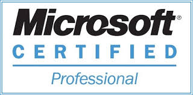
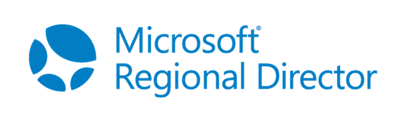
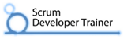
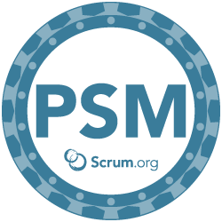
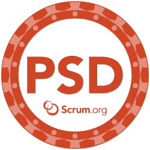
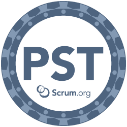
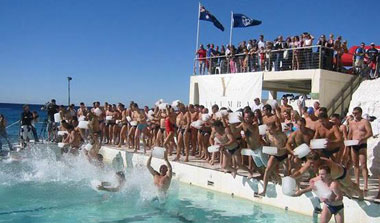

[[imgBadge]]
| 

[[imgBadge]]
| 

[[imgBadge]]
| 

[[imgBadge]]
| 

[[imgBadge]]
| 

[[imgBadge]]
| 

[[imgBanner]]
| 

Adam Cogan is the Chief Architect at SSW, a Microsoft Certified Gold Partner specializing in custom Azure, Azure DevOps (was TFS), .NET, SharePoint and Business Intelligence solutions. At SSW, Adam has been developing custom solutions for businesses across a range of industries such as Government, engineering, banking, insurance, and manufacturing since 1990 for clients such as Microsoft, Worley Parsons, and Aurecon.

Adam is a Certified Scrum Trainer with scrum.org, trains developers in Australia, the US, UK and Europe, and contributes to scrum.org thinking. He consults with development teams on improving their scrum process through mentoring and being a proxy scrum master. He has written many rules around scrum best practices.

Adam is one of only three Microsoft Regional Directors in Australia. In this role, he regularly presents at conferences such as TechEd (USA, Australia, New Zealand, Europe and Malaysia). A couple of times a year, he visits Microsoft headquarters in Seattle to learn the latest on Microsoft strategic directions and to undertake training in development technologies. His favourite Microsoft teams that he loves to work with are Brian Harry's TFS team and Jeff Teper's SharePoint team.

Adam travels to record interviews with technology experts around the world – his most popular video is a scrum meeting with the Microsoft Scrum Foundation team. You can view this video at [https://tv.ssw.com/daily-scrum-at-microsoft](https://tv.ssw.com/daily-scrum-at-microsoft)

At SSW, Adam enjoys working with the teams, improving their usage of Scrum and TFS, reviewing the architecture of large .NET projects, while also taking an active interest in the overall User Experience (UX). He is also the founder and a mentor of SSW’s [FireBootCamp](https://firebootcamp.com), an intensive 9-week .NET training course.

Some of Adam's project highlights have been:

- Adam lead the SSW-Telerik Event Cinema website redesign using Scrum
- Being lead developer on Australia's first live ASP.NET site - using a version that was pre Beta 1.
- Developing the SQL Reporting Services and Exchange Server samples for Microsoft that turned into a hugely popular Exchange Reporting Tool. Giving the first BI solutions on Exchange Server Data.
- Being the Chief Architect on the SharePoint site for Worley Parsons which was the largest public facing site at the time (it used the built in Web Content Management features, proving the SharePoint Platform for all companies).
- Being the Product Owner for SSW's SharePoint implementation.
- Being the TFS MVP of the year, proving his leadership in demonstrating the value of the ALM tools.
- His dual role as mentor and "Bob the Product Owner" at the first ever FireBootCamp

In addition Adam is a regular speaker at the SSW User Group and conferences, including:

- Adam has spoken at NDC Olso and NDC Sydney and was the #2 speaker of the conference (after Troy Hunt)

- Microsoft Tech Ed in USA (including a highly rated joint session with Billy Hollis), Malaysia, New Zealand and Australia (recently ranked in top 4 of 90 speakers in NZ)
- Microsoft Roadshows
- SSW's BrainQuest: TFS and SharePoint
- Dev Days Australia wide
- VS Live Australia and Chicago
- IDC Conferences South Africa and SGW Forum's DevCons
- Code Camp Australia, New Zealand Los Angeles and San Diego
- SQL Code Camp Australia and New Zealand
- Lecturer at University of Technology, Sydney

Adam is also the president of the Microsoft .NET User Groups in Sydney and Canberra, and is also the chair of the Speaker Bureau of the APAC INETA organization.

<iframe width="710" height="400" src="https://www.youtube.com/embed/0gSgpzmbrBM" frameborder="0"></iframe> 

### Made in Australia, China and beyond

In 2005 Adam took SSW beyond Australia and opened an SSW branch in China. There are now also SSW branches in 3 locations within Australia – Brisbane, Melbourne and the Sydney headquarters - as well as a satellite branch in Europe. Today all SSW developers work closely together to develop high quality software with high performing teams for the US, Australian and international markets.

Adam loves to spend time working on his Rules pages, and his favourite quote is "There is always free cheese in a mousetrap".

[[imgMd]]
| 

[[imgMd]]
| 

[[imgMd]]
| 

### What have others said about Adam's speaking?

> "He is the closest thing to a Geek rock star"

> "I enjoy Adam's presentations as he is the closest thing to a “geek rock star” that I have ever seen!"

> "Thanks heaps for putting together a great conference. I loved the emphasis on real examples. I loved Adams presentation style, very dynamic and he kept the interest level up and audience awake"

> "Adams session on creating Windows Apps was the best ever… great VB demos"

> "Adam Cogan is very inspiring, humorous and a pleasure to watch. For my first time here I'm impressed at the objective opinions of good and bad parts of MS VS .NET - very happy it wasn't a propaganda mission"

> "I've attended many Roadshows etc over the years - Adam Cogan is probably the best and most realistic speaker I've heard"
