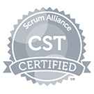

[[imgBadge]]
| 

[[imgBadge]]
| 

[[imgBadge]]
| 

[[imgBadge]]
| 

[[imgBadge]]
| 

[[imgBadge]]
| 

[[imgBadge]]
| 

Adam Cogan blogs at adamcogan.com and interviews for tv.ssw.com frequently. He is the Chief Architect at SSW, a Microsoft Certified Gold Partner specializing in custom enterprise .NET and Azure solutions mostly using Angular and React. His solutions also involve Office365, SharePoint, Dynamics 365 and Power BI. 

**Clients** - At SSW, Adam has been developing custom solutions for businesses across a range of industries such as Government, engineering, banking, insurance, and manufacturing since 1990 for clients such as Microsoft, CBA, and Aurecon.  

**Scrum** - Adam is a Certified Scrum Trainer with scrum.org, trains developers in Australia, the US, UK and Europe, and contributes to scrum.org thinking. He consults with development teams on improving their scrum process through mentoring and being an SSW Solution Architect and Scrum Master. He has written many rules around Scrum best practices. 

**China** - Adam has also run multiple consulting firms in China for the last 12 years. Adam has seen the whole Chinese software ecosystem develop and understands the differences that the Chinese market requires in order to be successful. Adam helps western companies modernize their software, so they are not only servicing the USA and European markets, but also grabbing a slice of the Chinese market of 1.4 billion consumers. 

**Speaking** - In addition to being a Microsoft MVP in Azure DevOps, Adam is one of only 3 Microsoft Regional Directors in Australia. In this role, he regularly presents in conferences such as TechEd (USA, Australia, New Zealand, Europe and Malaysia). A couple of times a year, he visits Microsoft headquarters in Seattle to learn the latest on Microsoft strategic directions and to undertake training in development technologies. His favourite Microsoft teams that he loves to work with are Nat Friedman’s GitHub and Azure DevOps team, James Phillips’ Power BI team and Jeff Teper’s SharePoint team.  

[[imgMd]]
| 

**Software Architecture** - Adam enjoys working with teams, improving their usage of Scrum and DevOps, reviewing the architecture of large .NET and Azure projects, while also taking an active interest in the overall User Experience (UX). He is also the founder and a mentor of SSW’s FireBootCamp, an intensive 9-week .NET training course where developers are retrained learning developer and architecture best practices. 

Some of Adam's career highlights have been: 

- Training thousands of developers around the world 
- Growing the career of hundreds of SSW employees over 3 decades 
- Seeing many of Adam Cogan’s former employees go on to do great things 
  - Tatham Oddie – CEO of readily.net 
  - Paul Stovell – CEO of octopus.com 
  - Damian Brady – Mr. Devops at Microsoft Worldwide 
  - Adam Stephensen – Mr. Azure at Microsoft Australia 
- Being the Product Owner of many SSW products, such as SugarLearning.com and SSWTimePro.com  
- Being the Azure DevOps (was TFS) MVP of the year, proving his leadership in demonstrating the value of the ALM tools 
- Leading the SSW-Telerik Event Cinema website redesign using Scrum 
- Being lead developer on Australia's first live ASP.NET site - using a version that was pre-Beta 
- Developing the Office integration for Quicken Australia 
- Developing the Reporting samples for Microsoft that turned into a hugely popular Email Reporting Tool 
- Developing the SharePoint site for Worley Parsons which was the largest public facing site at the time (it used the built in Web Content Management features, proving the SharePoint Platform for all companies) 
- His dual role as mentor and "Bob the Product Owner" at the first ever FireBootCamp 
- Writing thousands of best practices on rules.ssw.com.au  

[[imgMd]]
| 

In addition, Adam is a regular speaker at the SSW User Group and other conferences, including: 

- NDC Olso, NDC Porto, and NDC Sydney where he was the #2 speaker of the conference (after Troy Hunt) 
- Microsoft Tech Ed in USA (including a highly rated joint session with Billy Hollis), Malaysia, New Zealand and Australia (recently ranked in top 4 of 90 speakers in NZ) 
- Dev Days Australia wide 
- VS Live Australia and Chicago 
- IDC Conferences South Africa and SGW Forum's DevCons 
- Code Camp Australia, New Zealand Los Angeles and San Diego 
- SQL Code Camp Australia and New Zealand 
- Lecturer at University of Technology, Sydney 

#### What have others said about Adam's speaking?

> "He is the closest thing to a Geek rock star"

> "I enjoy Adam's presentations as he is the closest thing to a “geek rock star” that I have ever seen!"

> "Thanks heaps for putting together a great conference. I loved the emphasis on real examples. I loved Adams presentation style, very dynamic and he kept the interest level up and audience awake"

> "Adams session on creating Windows Apps was the best ever… great VB demos"

> "Adam Cogan is very inspiring, humorous and a pleasure to watch. For my first time here I'm impressed at the objective opinions of good and bad parts of MS VS .NET - very happy it wasn't a propaganda mission"

> "I've attended many Roadshows etc over the years - Adam Cogan is probably the best and most realistic speaker I've heard"

Adam does many videos for tv.ssw.com.au and has recorded many interviews with technology experts around the world – his most popular videos are: 

- [Azure Superpowers](https://www.youtube.com/watchv=5qFgqTLLRjo&list=PLpiOR7CBNvlp0L_t5Mq7kqeSgvlpl4mQh)
- [9 Knights of Azure](https://youtu.be/-Ac7z3YEkNI)
- [Chinafy your apps + Lessons you can steal from China](https://youtu.be/NtuFfWVJF_w)
- [What's New in Visual Studio9](https://youtu.be/4F0B1GdqK5c)
- [Going Hardcore on your Business Intelligence with Power BI](https://youtu.be/0gSgpzmbrBM)
- [Scrum at Microsoft: See the TFS Agile Team do a Daily Scrum](https://youtu.be/YR84qH6d7QE)

[[imgMd]]
| 

More at [www.adamcogan.com](https://adamcogan.com/)
