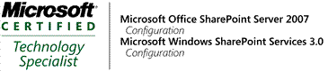

 

Alvin is a Software Architect at SSW. He specializes in developing solutions with .NET Framework 3.5,C#,VB.NET,XML,Web Service,ASP.NET and SQL Server. He is also familar with some design softwares such as Photoshop and Dreamweaver.   
Alvin's client projects: 

*   **eMove** A agent company looking to build their e-business website by using DNN  
Related Technology: .NET NUKE(DNN),ASP.NET 2.O Application,VB.NET,SQL Server 2005, 
    **QWI(Queensland Water Infrastructure Pty Ltd )** A government founded company looking to deploy sharepoint in their system  
Related Technology: SharePoint 
    **Swift** A heavy engineering company looking to build a ERP like internal management system  
Related Technology: ASP.NET 3.5 Application, C#, WPF, WCF, Web Service, Workflow, LINQ, SQL Server 2005   
Alvin's internal projects: 

*   **SSW Website** SSW's official website. Helped to upgrade our website form ASP.NET 2.0 TO ASP.NET 3.5, Fixed sync. problems among different servers and TFS.  
Related Technology: XML,ASP.NET 3.5,C#,VB.NET,Web Service,TFS 
    **SSW Share Point Site** 

    *   Related Technology: XML,ASP.NET 3.5,C#, Share Point (MOSS 2007)
    **Microsoft New Technologies Presentation** Helping Adam Cogan our Chief Architect prepare the demos and scripts of presentation and assiting him in road show around Sydney's universities. Related Technology: C#, SilverLight, LINQ, ASP.NET 3.5 
*   In spare time, Alvin is also a photographer. Portfolio site: [http://www.lookingfor304.com/](http://www.lookingfor304.com/) 