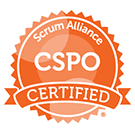

[[imgBadge]]
|  
  

Alvin Shen is the CEO of SSW China managing SSW Beijing and SSW Hangzhou Office.  

Alvin has been working in the development realm for more than 13 years, both in China as well as in Australia. In that time, he has established himself as a passionate expert and industry leader. He started as a .NET and SharePoint developer, but through his passion for Scrum and his entrepreneurial spirit, he was able to leverage his skills to become a great Product Owner, as well as a business development manager, and even a CEO of a startup with 70 people before joining SSW.  
Because of his business experience both in China and in Australia, he understands the differences between the way the East and the West do business and can bridge the two to ensure symbiotic communication and satisfactory outcomes for all sides. Alvin could provide valuable insights into the trends, desires, and realities of the Chinese market, and the challenges faced by companies both in and outside of China who wish to do business together.   

His primary areas of expertise cover Chinafy, Scrum and agile development and cloud technologies, especially Microsoft Azure, and the leading Chinese cloud, Alibaba cloud, and he continues to remain abreast of the latest developments in .NET.  
