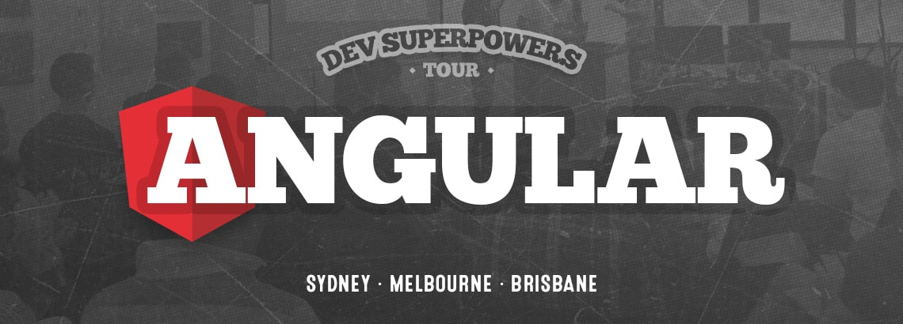
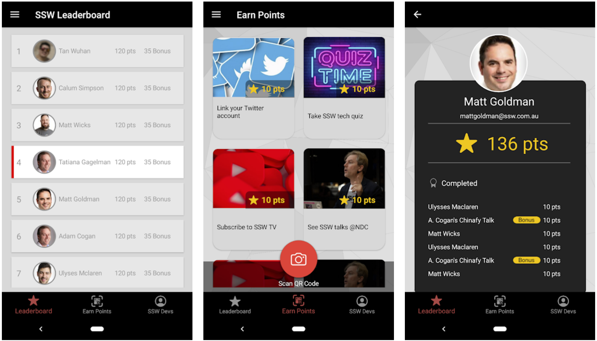

[[imgBadge]]
| 

[[imgBadge]]
| 

[[imgBadge]]
| 

[[imgBadge]]
| 

[[imgBadge]]
| 

[[imgBadge]]
| 

[[imgBadge]]
| 

[[imgBadge]]
| 

Andreas is an experienced Software Developer with a demonstrated history of working in the information technology and services industry.

## Development Technologies

Andreas has a passion for developing enterprise-grade Web Applications, and automating Build, Release and Testing with GitHub Actions and Azure DevOps Pipelines.

His technology toolbelt includes:

* Angular
* Azure DevOps
* ASP.NET Core
* Blazor
* Serverless Functions
* [Clean Architecture](https://rules.ssw.com.au/rules-to-better-clean-architecture)
* GitHub Actions
* Microservices
* React
* and more...

Development and DevOps aren't his only strong points. He is a highly motivated [Scrum](https://www.ssw.com.au/ssw/Consulting/Scrum.aspx) practitioner, strong team player and thinks outside of the box! Andreas has had great success in both starting new Scrum teams, and also upskilling and mentoring existing development teams.

Andreas has had experience with companies ranging from small businesses to large ASX listed companies in the finance, engineering and insurance sectors, helping them with:

- Build and Release Pipelines (full CI/CD automation on GitHub Actions and Azure DevOps)
- Document automation
- Process automation
- Dynamics 365 CRM and PowerApps
- Xamarin Mobile Apps

## Training

Andreas is a trainer on the [SSW Angular Superpowers Tour](https://www.ssw.com.au/ssw/Events/Training/Angular-Superpowers-Tour.aspx) at major cities around Australia and Online, and has received top evaluation scores!

[[imgLg]]
| 

His recent interests include learning mobile development with Xamarin cross platform mobile apps on the SSW Rewards app. 

[[imgMd]]
| 
