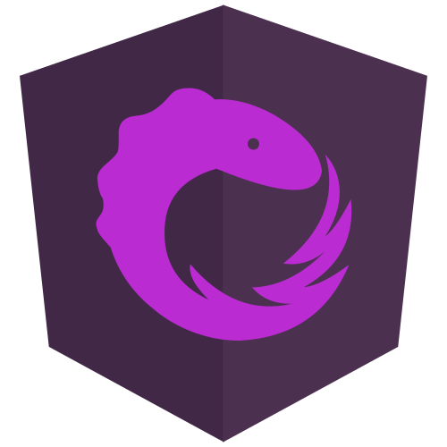

[[imgBadge]]
| 

[[imgBadge]]
| 

[[imgBadge]]
| 

Andreas is an experienced Software Developer with a demonstrated history of working in the information technology and services industry.

Andreas' main skills focus on .NET Core, Angular and React applications with bootstrap/material design, leveraging technologies like EF Core and Identity to provide the clients with rich user experiences.

Andreas is highly motivated, with strong technical skills, which allows him to understand and convert complex business requirements into software solutions.
