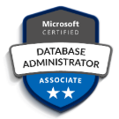

[[imgBadge]]
| 

[[imgBadge]]
| 

[[imgBadge]]
| 

[[imgBadge]]
| 

[[imgBadge]]
| 

[[imgBadge]]
| 

[[imgBadge]]
| 

[[imgBadge]]
| 

[[imgBadge]]
| 

[[imgBadge]]
| 

[[imgBadge]]
| 

[[imgBadge]]
| 

[[imgBadge]]
| 

---
Ben is a software developer based in the Sydney office. He is currently pursuing a bachelor's degree in Software Engineering at the Univeristy of Technology Sydney (UTS), and is one of the top students in the engineering faculty. Ben is an exceptional full-stack developer, specializing in Angular apps with complex state management requirements. Ben is always expanding his skillset, with his current focus on the cloud and building enterprise-grade applications using Azure.

His favourite tools include: 
- **Angular** + **NgRx**
- **RXJS**
- **.NET**
- Git
- Docker/Containerization
- Azure

## Frontend  
Ben has a great deal of experience handling complex state management, and he loves working with Angular and NgRx to build rich client-side apps with a focus on amazing UX.

## Backend + Third party integration
Ben loves building Web APIs with .NET and EF Core, and has experience integrating various 3rd party systems such as Xero, Power BI, and SRSS. He's often busy helping clients with their .NET migrations, moving large projects from older .NET Frameworks to modern .NET.

## Mentoring
Ben is always happy to mentor other developers, and is currently a Tech Lead for SSW's internship program - SSW FireBootCamp. He helps educate interns (and other SSW developers!) on development best practices, code quality, and Scrum processes.
