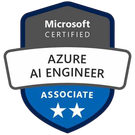

[[imgBadge]]
| 

[[imgBadge]]
| 

[[imgBadge]]
| 

[[imgBadge]]
| 

[[imgBadge]]
| 

[[imgBadge]]
| 

[[imgBadge]]
| 

[[imgBadge]]
| 

[[imgBadge]]
| 

[[imgBadge]]
| 

[[imgBadge]]
| 

[[imgBadge]]
| 

[[imgBadge]]
| 

[[imgBadge]]
| 

---
Ben is a Sydney-based consultant at SSW who specialises in **Azure** cloud architecture, **DevOps** automation, and full-stack application development. He has experience helping enterprises modernise legacy systems, migrate workloads to the cloud, and deliver secure, automated platforms that scale with business growth. Known for his pragmatic and outcome-driven approach, Ben bridges the gap between architecture, development, and operations to help organisations achieve faster, safer, and more reliable cloud solutions.

A dedicated open-source maintainer, Ben contributes to **TinaCMS**, a world-leading headless CMS with over **10,000 GitHub stars**. His work focuses on improving extensibility, performance, and developer experience for thousands of users worldwide.

## Azure / Cloud & DevOps
Ben designs secure, scalable, and fully automated cloud environments on **Microsoft Azure**. With deep expertise in cloud security, networking, and infrastructure governance, he has successfully migrated complex **on-premises** microservice systems into Azure, implementing **private network architectures** that meet strict enterprise compliance standards. His work focuses on network isolation, private endpoints, and role-based access control (RBAC) to ensure all resources communicate securely within controlled boundaries.

He automates Azure resource provisioning using **Infrastructure as Code (Bicep)** to deliver consistent, auditable deployments across environments. Ben also builds resilient CI/CD pipelines with **GitHub Actions** and **Azure DevOps**, integrating containerisation, automated testing, and infrastructure validation to create reliable, secure, and maintainable cloud solutions.

## Full-Stack Development
Ben delivers end-to-end enterprise applications that combine refined frontend experiences with robust backend systems. Using Angular, NgRx, and Next.js, he builds high-performance, state-driven interfaces supported by clean, maintainable APIs built with .NET 8 and EF Core. On the backend, Ben focuses on designing modular monolith architectures and clean enterprise solutions, enabling scalability, maintainability, and clear domain boundaries across large systems.

He has led several enterprise integration projects involving Xero, Power BI, and SSRS, ensuring seamless interoperability and insight generation. Most notably, Ben spearheaded a large-scale migration from .NET Framework to .NET 8, eliminating over one million lines of technical debt and achieving major improvements in performance, maintainability, and developer velocity

## Mentoring
As Tech Lead for SSW FireBootCamp, Ben mentors developers and consultants in software engineering best practices, DevOps, and agile delivery. Known for his collaborative and approachable style, he helps teams adopt modern cloud and DevOps workflows while improving their code quality, solution design, and architectural thinking

## Videos

<iframe width="560" height="315" src="https://www.youtube.com/embed/vPa1bX-ZQ38?si=OM3Ad3UsL0GuFpiu" title="YouTube video player" frameborder="0" allow="accelerometer; autoplay; clipboard-write; encrypted-media; gyroscope; picture-in-picture; web-share" referrerpolicy="strict-origin-when-cross-origin" allowfullscreen></iframe>

<iframe width="560" height="315" src="https://www.youtube.com/embed/cChyJFvVo4A?si=ItW2i4F-_gSAK3Qx" title="YouTube video player" frameborder="0" allow="accelerometer; autoplay; clipboard-write; encrypted-media; gyroscope; picture-in-picture; web-share" referrerpolicy="strict-origin-when-cross-origin" allowfullscreen></iframe>

