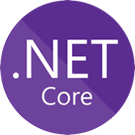
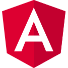
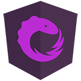

[[imgBadge]]
| 

[[imgBadge]]
| 

[[imgBadge]]
| 

[[imgBadge]]
| 

[[imgBadge]]
| 

---

Throughout his career, Brendan has been a big user and proponent of Open Source software. This has been applied to a broad variety of web-based programming projects spanning the last 17 years.  Brendan has worked with an eclectic mix of languages, platforms and technologies including .Net, Java, PHP, Ruby and Perl across both Unix/Linux and Microsoft Windows platforms. This gives Brendan some unique perspectives on how different teams & platforms have tackled similar problems.

Since joining SSW in 2012, Brendan has been delivering great solutions on the .NET stack for his clients. He is also been sharing his knowledge and experience with the wider developer community by:

- Speaking at Conferences such as NDC ([Watch video](https://www.youtube.com/watch?v=fGmbXCrgKtg)) and DDD

- Speaking at .NET User Groups

- Delivering Training on .NET Core and Angular Via SSW's Dev SuperPowers Tour.

  - [Angular Dev SuperPowers](https://www.ssw.com.au/ssw/Events/Training/Angular-Superpowers-Tour.aspx)
  - [.NET Core Dev SuperPowers](https://www.ssw.com.au/ssw/Events/Training/NET-Core-Superpowers-Tour.aspx)

- Getting involved in othe community events including "Angular Hackday" and "Hack4Good"

His only problem seems to be that he's interested in too many topics! In the last few years, he's delivered talks or training on all of the below:

- Entity Framework Core and Clean Code

- Angular, State Management and ngrx

- Reactive Programming and Redux in .NET

- Linux, Docker and Azure

- .NET Core

- Elastic Search

- OpenAPI / Swagger

- Blazor
