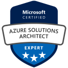
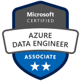
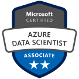
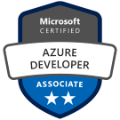
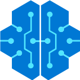

[[imgBadge]]
| 

[[imgBadge]]
| 

[[imgBadge]]
| 

[[imgBadge]]
| 

[[imgBadge]]
| 

[[imgBadge]]
| 

[[imgBadge]]
| 

[[imgBadge]]
| 

[[imgBadge]]
| 

[[imgBadge]]
| 

[[imgBadge]]
| 

[[imgBadge]]
| 

[[imgBadge]]
| 

[[imgBadge]]
| 

[[imgBadge]]
| 

[[imgBadge]]
| 

---

Bryden is a **Solution Architect** with over 30 years professional experience. He has a wealth of knowledge from a diverse range of areas but with particular focus on database, web services, Microsoft Azure and SaaS based solutions. He's had dealings with customers ranging from the world's largest companies right through to small business. He has a strong understanding of how software will deliver business value to his customers.

## Cloud Solutions
Bryden loves working with the full range of Azure technologies to build customized, efficient and cost efficient solutions to your problems. He has exceptional experience gained working directly with Microsoft Development teams in Azure Functions, Cosmos DB and SQL Server solving enormously high scale, complex problems.

## Database and Application Performance 
Years of experience building software to help customers understand the performance of their database and applications, gives Bryden a unique perspective on the difficulties of managing your data and how to ensure it grows painlessly as your organization grows.

## Building Skills
Bryden enjoys helping others improve their skills and would relish the opportunity to help your staff grow while building solutions with them. He has worked on mentoring staff at varying points in their careers over many years.
