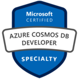

[[imgBadge]]
| 

[[imgBadge]]
| 

[[imgBadge]]
| 

[[imgBadge]]
| 

[[imgBadge]]
| 

[[imgBadge]]
| 

[[imgBadge]]
| 

[[imgBadge]]
| 

[[imgBadge]]
| 

[[imgBadge]]
| 

[[imgBadge]]
| 

[[imgBadge]]
| 

[[imgBadge]]
| 

[[imgBadge]]
| 

[[imgBadge]]
| 

[[imgBadge]]
| 

[[imgBadge]]
| 

---

Bryden is a **Solution Architect** with over 30 years professional experience, working with customers from small businesses to the world's largest companies. He has a wealth of knowledge from a diverse range of areas, particularly focused on databases, web services, Microsoft Azure, and SaaS solutions. Bryden has a strong understanding of how software will deliver business value.

### Cloud Solutions
Bryden loves working with the multitude of Azure technologies to build customized, structured, and cost-efficient solutions. His exceptional experience has solved  enormously high-scale complex problems, while working directly with Microsoft Development teams in Azure Functions, Cosmos DB, and SQL Server.

### Database and Application Performance 
With years of experience building software, Bryden has been helping customers understand and improve the performance of their database and applications. Bryden's unique perspective on the difficulties of managing data allows their custom-built applications to grow painlessly as the organization evolves.

### Building Skills
Bryden enjoys seeing people improve their skills, and would relish the opportunity to help others grow whilst building software solutions with them. He has been a mentor to staff at varying points in their careers over several years.
