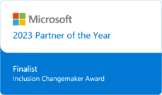
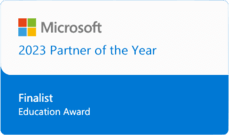

[[imgBadge]]
| 

[[imgBadge]]
| 

Calum is a distinguished enterprise software consultant specialising in Microsoft technologies, including Azure, SharePoint, Dynamics 365/Power Platform, and C# .NET. He also brings a strong proficiency in both Angular and React to his diverse skill set.

Boasting over a decade of experience, Calum has successfully spearheaded web projects across a spectrum of environments, from agile two-person startups to some of the most prominent corporations in Australia. His versatility in handling projects of various scales speaks to his adaptability and prowess in the field.

More recently, Calum has positioned himself at the forefront of LLM consulting. His innovative approach in this domain has played a pivotal role in executing several client projects, leveraging this advanced technology to revolutionize our interaction with digital platforms. His contributions underscore his commitment to staying ahead of technological trends and delivering cutting-edge solutions.
