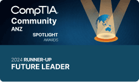

[[imgBadge]]
| 

[[imgBadge]]
| 

[[imgBadge]]
| 

Calum is a distinguished enterprise software and AI consultant specialising in Microsoft technologies, including Azure, SharePoint, Dynamics 365/Power Platform, and C# .NET. He combines deep platform expertise with a strong focus on applied AI, bringing modern intelligence into scalable enterprise solutions, alongside proven capability in both Angular and React.

Boasting over a decade of experience, Calum has successfully spearheaded web projects across a spectrum of environments, from agile two-person startups to some of the most prominent corporations in Australia. His versatility in handling projects of various scales speaks to his adaptability and technical leadership.

More recently, Calum has positioned himself at the forefront of LLM consulting. His innovative approach in this domain has played a pivotal role in executing several client projects, leveraging advanced AI technologies to reshape how organisations design, build, and interact with digital platforms. His contributions underscore his commitment to staying ahead of technological trends and delivering practical, cutting-edge solutions.
