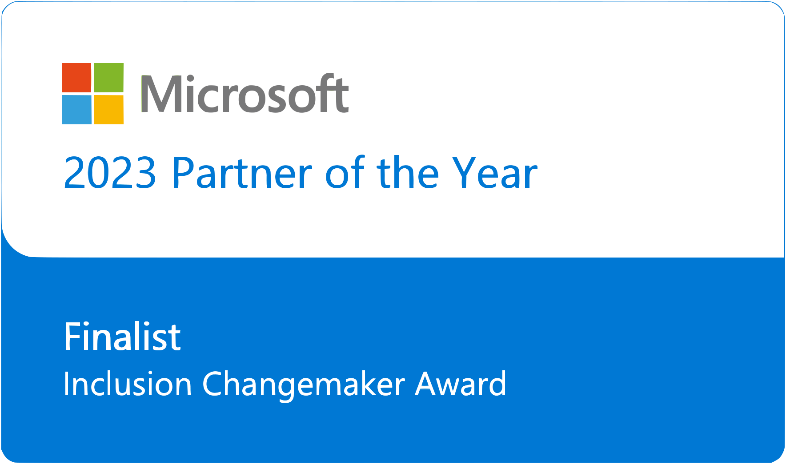
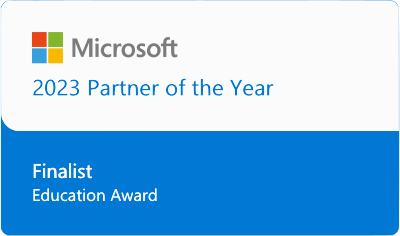

[[imgBadge]]
| 

[[imgBadge]]
| 

Calum is an enterprise software consultant specialising in Microsoft technologies - Azure, SharePoint, Dynamics 365/Power Platform, C# .NET, plus experience in Angular and React. 

He has over 8 years of experience working on web projects of various sizes ranging from a 2-person start up to one of the largest companies in Australia.  

Aside from developing web projects, he is also interested in electrical engineering and financial quantitative analysis.  
