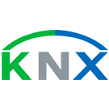
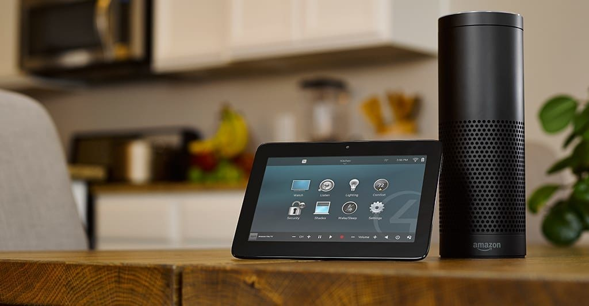

[[imgBadge]]
| 

[[imgBadge]]
| 

Chris is one of two main electricians working out of the SSW Newcastle office. He is a fully qualified electrician, with over 20 years of experience in domestic, commercial, and industrial electrical work.

He has proven electrical project management skills, managing both small and large projects. His vast array of experience and expertise includes [designing and constructing automation systems (such as Control4) for Smart Offices and Smart Homes](https://www.ssw.com.au/ssw/consulting/Smart-Office-and-Smart-Home.aspx), extensive control wiring work, commercial and electrical layout lighting design, installation of programming network products (such as Ubiqiti and Pakedge), and the integration of all aspects of electrical, security, and networking systems.

Chris is passionate about his work, he is motivated, proactive, and has proven leadership skills, as evidenced by his experience in supervising tradesmen and apprentices.

[[imgLg]]
| 
