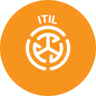

Christian is a Software Developer with over 5 years of experience working with a wide range of technologies and Azure resources.  

Specialising in backend .NET development and API integration. He enjoys working on process improvement and automation through PowerShell scripting and Azure Build Pipelines.  

He is familiar with many of Azure Services offered by Microsoft including working with ARM templates, App Services, Databases, Storage, Messaging and Authentication.  

In addition, Christian is Certified in ITIL Foundations Service Management and has experience working across all levels of support.  

[[imgBadge]]
|  
  
