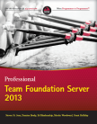

 
   
_1509.png)   
    
  
 Damian is a Solution Architect and Microsoft MVP in Visual Studio ALM who runs our Brisbane SSW Office.  

 With well over ten years of experience both in software development and business analysis roles, Damian has had exposure to a large number of industries including government and finance. A software architect with a wide skillset, he is able to use his excellent technical skills and knowledge of business process to deliver the most effective solutions to our clients.  

 His main loves are helping Scrum teams run smoothly and effectively using TFS, and delivering great ASP.NET MVC web applications. He has also had extensive experience in .Net WinForms applications, mobile-targeted websites, and SQL Server.  

 Damian is very active in the Brisbane developer community and runs both the [Brisbane .Net User Group](http://www.meetup.com/Brisbane-Net-User-Group/ "Brisbane .Net User Group") (formerly Qld MSDN User Group and the 
[DeveloperDeveloperDeveloper Brisbane](http://www.dddbrisbane.com/ "DDD Brisbane") conference.  He is also a regular speaker at the 
[Queensland ALM](http://www.qalmug.org/ "Qld ALM User Group") user group and various conferences and user groups in other states. He's also a co-author of "[Professional Team Foundation Server 2013](http://brdy.in/ProTFS2013)".  

 In his spare time, Damian plays indoor and beach volleyball, and is an avid St. Kilda AFL supporter. 
  

**Damian's client projects include:**  

*   **Management Advantage - Mentoring and Development  
 **Management Advantage is a leading provider of aged care and clinical management software. Looking to move their legacy VB6 codebase to .Net and improve their software development process, they engaged SSW to help. Since coming on board, we've implemented an effective Scrum process, provided guidance on best practices for .Net development, and mentored the development team in both technical and process areas.

*   **Australia Day Council website**  
Damian worked on the public-facing website for the National Australia Day Council along with a handful of other SSW developers. Built on Umbraco with plenty of customization for search as well as submission and management of events, it has evolved into a very performant and effective site.
*   **An Internal Management Application for a major electricity provider  
 **A long-running project, Damian came on board to help bring the software to completion.  Combining DynamicData, ASP.Net, and rich Silverlight interfaces, the solution was a powerful tool to help their management team.
  
**Damian's other work includes:**  

*   [SQL Deploy MVC](http://nuget.org/packages/SSW.SQLDeploy.MVC): Conceived and Implemented with [Adam Stephensen](/AboutUs/Employees/Pages/AdamS.aspx)

**Damian's Presentations:**

*   What’s new for ALM in Visual Studio 2013 and Team Foundation Server 2013 - Presented with Adam Cogan at [Tech Ed Australia](http://channel9.msdn.com/Events/TechEd/Australia/2013/DEV211) and [Tech Ed NZ](http://channel9.msdn.com/Events/TechEd/NewZealand/2013/DEV101)
*   Climbing the Agile Testing Ladder - Presented with Adam Cogan at [Tech Ed Australia](http://channel9.msdn.com/Events/TechEd/Australia/2013/DEV323B) and [Tech Ed NZ](http://channel9.msdn.com/Events/TechEd/NewZealand/2013/DEV303)
*   SSW Enterprise MVC Courses [Part 1](http://www.ssw.com.au/ssw/events/Training/enterprise-MVC-part-1.aspx) and [Part 2](http://www.ssw.com.au/ssw/events/Training/Enterprise-MVC-Part-2.aspx) - Written and presented with [Adam Stephensen](/AboutUs/Employees/Pages/AdamS.aspx)
*   [Zero to Everywhere with ASP.NET MVC](http://tv.ssw.com/1785/ddd-brisbane-damian-brady-zero-to-everywhere "Zero to Everywhere with ASP.NET MVC")
*   [Building Mobile Websites with ASP.NET MVC 3 and 4](http://www.slideshare.net/damovisa/building-mobile-websites-with-aspnet-mvc-3-4-11395594 "Building Mobile Websites with ASP.NET MVC 3 and 4")
*   [How to be a good TFS Master](http://www.slideshare.net/damovisa/how-to-be-a-good-tfs-master "How to be a good TFS Master")
*   More presentations can be found with the "Presentations" tag on my blog - [http://blog.damianbrady.com.au/category/technology/presentations/](http://blog.damianbrady.com.au/category/technology/presentations/)