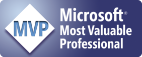

  
  
_1477.jpg)  
_NETFX.jpg)

 Danijel is a DevOps mastermind who can make your DevOps cycle running like a well-oiled machine in almost no time. With a wide range of technical skills and a deep desire to understand the client's business first, he will be the person you can always rely on, to get the best solution for your needs.

 As Solution Architect, he has been involved in numerous projects built on Microsoft Stack that are ranging from the manufacturing sector to medical services to taxes.

At SSW, as well as building solutions for clients, Danijel is the Product Owner for SSW Code Auditor.With an eye on the bleeding edge technologies, he is always one step ahead of the others, and he will generously share his experience and learnings at user groups and conferences.Danijel is also a Microsoft MVP for Visual Studio ALM. 
        
 
   Some of his client projects:  

*   <strong style="line-height:18px;">Carnival Australia - Cruise Control  
**Carnival Australia celebrated many successful projects with SSW over the last few years. Due to such a great partnership they wanted us to support Cruise Control application, which is one of the key websites for P&O. Danijel stepped in and took the project to the next level: besides coding he transformed the working process and moved them from ticketing system in SharePoint to Scrum with TFS. A month long release cycles got replaced with Continuous Delivery and fully automated deployments to production every few days.  
Related Technologies: TFS, Octopus Deploy, ASP.NET WebAPI, ServiceStack</strong> 
        

*   **Estate Master - TFS Migration & Release Management**  
Estate Master made a big move when they decided to migrate all their code from TFS 2008 and Visual SourceSafe to Visual Studio Online. Beside that Danijel establishes a Continuous Delivery practice where each check-in results in a new setup package.  
Related Technologies: VSO, PowerShell, Advanced Installer 
        

*   **EMA - Scrum Training**  
EMA is a Slovenian client who was looking for optimization of th****eir work processes. SSW provided them a tailored Scrum training with a significant focus on their business needs.  
Related Technologies: Visual Studio Team Services, Scrum 
        

*   **IP Payments - TFS Training**  
The client needed a fully customised training around TFS, to understand the product's capabilities and options for embracing DevOps.  
Related Technologies: TFS
*   **Brisbane Catholic Education - Student Protection**  
SSW has built numerous applications for Brisbane Catholic Education including Student Protection. Student Protection is a system that handles all complex processes for protection of their students in a nice web application with heavy workflows underneath.  
Related Technologies: ASP.NET MVC, AngularJS, SQL Server
*   **IRI Aztec - MSI Setup  
**Customized TFS Build pipeline on TFS 2010 to produce 6 MSI Packages as part of the build. Each package had a unique UI and product configuration logic.  
Related Technologies: TFS, Advanced Installer, PowerShell
*   **PwC - Comply First Time**  
PwC engaged SSW to help move their flagship business tax reporting platform built on top of Access and SQL server to the web.  
Related Technology: MVC5, SignalR, SQL Server 2012, AngularJS, Azure