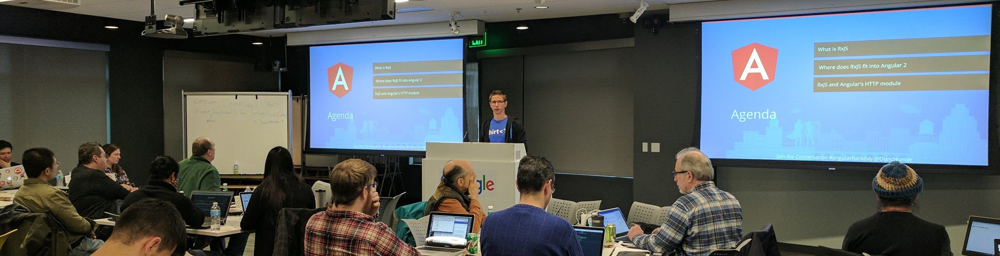

  
 

  
   

Duncan loves working in passionate teams to make awesome software.   

Making sustainable software that solves real world issues is what makes Duncan tick. He is a full stack web developer specialising in making responsive frontend applications with Angular and ASP.NET.   

With the current speed of change in frontend best practices, Duncan helps teams learning and implementing modern frontend build processes to produce scalable and maintainable applications quickly.   

Duncan is a passionate teacher and delivers courses around the world on best practices in Angular and ASP.NET Core.  
 
  

 Figure: Duncan teaching Angular  

**Duncan's client projects include:** 

*   **Class Super - Four different projects including Client View, Advisor Portal, Document Management System and Client Messaging**  
Class Super engaged SSW to rewrite their outdated web application in AngularJS and Typescript while upskilling their development team to master these frontend technologies.     
Related Technology: AngularJS, TypeScript, WebAPI, Kendo, Azure Web Jobs
*   <strong style="line-height:1.5em;background-color:initial;">Brisbane Catholic Education - Student Behaviour  
**Brisbane Catholic Education engaged SSW to build a student behaviour tracking tool that would be powerful, flexible, and easy to use for all of their school's administrators across South-East Queensland.   
Related Technology: Angular, TypeScript, WebAPI, ASP.NET Core and, Octopus Deploy</strong>

*   **PWC**  
PwC engaged SSW to help move their flagship business tax reporting platform built ontop of Access and SQL server to the web.  
Related Technology: MVC5, SignalR, SQL Server 2012, AngularJS, Azure
*   <strong style="background-color:initial;">Sugar Learning** is the next generation induction tool for smart companies  
Related Technology: MVC5 & Azure</strong>
*   **Link Auditor **is a link and rule checking web application.   
Related Technology: MVC5, AngularJS, Azure Web Jobs  

*   **Vopak **Contractor Timesheet Application  
Related technologies: MCV5, AngularJS, Kendo
*   More....  

      **** 

 **Duncan's other work includes:**  

*   [Foodzone](https://foodzone.com.au/)  Duncan is the founder of the leading Australian nutrition assessment software used by thousands of nutrition students and health professionals.

 **Duncan's Present**<strong style="line-height:1.6;">ations: **

*   [duncanhunter.com.au/media/ ](https://duncanhunter.com.au/media/)   

 When he's not making software, he will likely be climbing a cliff face somewhere. He has climbed for the last 20 years with ascents of some of the tallest rocks in the world from Yosemite's El Capitan to Himalayan big walls in Pakistan.  
 
      **** 

  
   
 Figure: Duncan climbing on [Nameless Tower](http://en.wikipedia.org/wiki/Trango_Towers) in Pakistan  

</strong>