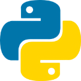

[[imgBadge]]
| 

[[imgBadge]]
| 

[[imgBadge]]
| 

[[imgBadge]]
| 

[[imgBadge]]
| 

[[imgBadge]]
| 

[[imgBadge]]
| 

[[imgBadge]]
| 

[[imgBadge]]
| 

[[imgBadge]]
| 

[[imgBadge]]
| 

[[imgBadge]]
| 

[[imgBadge]]
---

Eddie is an SSW Software Developer with a keen eye for detail, and a passion for creating high-quality, efficient solutions. He is currently in his penultimate year of a Bachelor of Advanced Computing (Software Development) degree at The University of Sydney, writing his thesis on the topic of "Portal Redirection in Virtual Reality using Impossible Spaces". 

Eddie has a strong foundation in software development. In addition to his university degree, he completed SSW's FireBootCamp, gaining experience developing with Scrum in .NET and Angular, in addition to the Azure platform and OpenAI API. 

In his free time, Eddie loves hands-on projects, such as fixing, building and maintaining motorcycles and bicycles 🏍️🚲, in addition to 3D printing, and woodworking 🪚. To keep his mind sharp, he enjoys reading and solving crossword puzzles 📖, and to keep his body active, he practices cycling and bouldering 🧗‍♂️.
