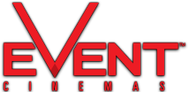
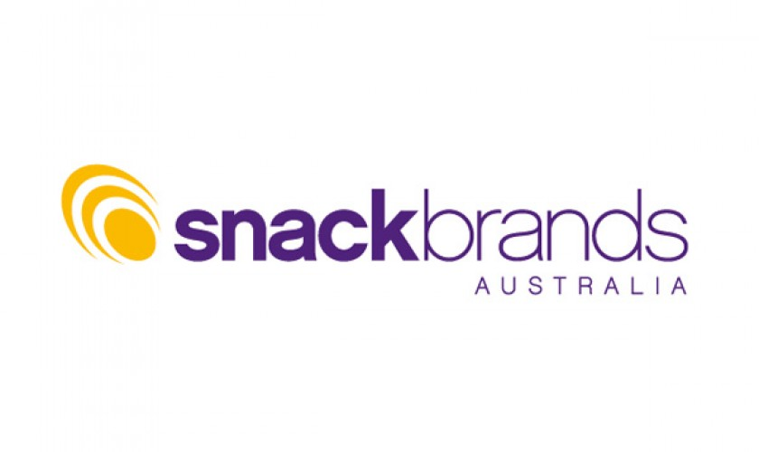
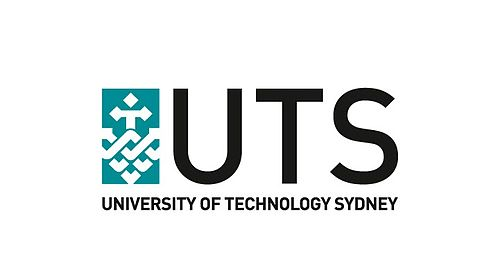

 
    

## 

  
  

##  
       
  
  
  
    

Eric is the ultimate Chief Architect. His wide range of technical skills, and deep knowledge of certain specialty technologies, mix well with his amiable manner and excellent communication skills.  

He has in-depth knowledge of .NET and the Microsoft Stack and is exceptional at delivering high quality and value products to your business. He came from the Java (J2SE & J2ME) world and values running strong teams, .NET architecture, unit testing and maintainable code via coding standards.

Eric is always on the cutting edge, using Microsoft's latest technologies before they are widely adopted. At SSW he helps drive adoption of the latest technology to make sure our developers are up to date with everything happening in the world of software development. He also is a frequent presenter at user groups and technical breakfasts where he shares his experiences using these technologies.

Eric's client projects include:  

<table cellspacing="0" width="100%" class="ms-rteTable-default" style="height:1131px;"><tbody><tr class="ms-rteTableEvenRow-default"><td class="ms-rteTableEvenCol-default" style="width:7%;height:36px;text-align:center;"> 
 

       </td><td class="ms-rteTableOddCol-default" style="width:50%;height:36px;"> 
       ** Price Waterhouse Coopers - Comply First Time**  
PwC engaged SSW to help redevelop their flagship business tax reporting and compliance platform that was originally built on top of Access and SQL server. SSW modernized and re-architected the platform to be web based and built on good enterprise practices.   

Since successfully launching Comply First Time to a client base of some of Australia's largest companies, SSW has helped PwC expand the capabilities of their product to also encompass other areas of compliance like Employment Taxes and Worker's Compensation.   

We've also helped PwC take this product global, brining it into the Malaysian, New Zealand, Swiss and other European jurisdictions. This platform has also been chosen as the standard global platform for PwC indirect taxes (initially there were many competing products developed internally by other PwC divisions)   

[http://www.pwc.com.au/goods-and-services-tax/comply-first-time.html](http://www.pwc.com.au/goods-and-services-tax/comply-first-time.html)  
**Related Technology**: MVC 5, SignalR, SQL Server 2016 , AngularJS, Azure, WebAPI  
</td></tr><tr class="ms-rteTableOddRow-default"><td class="ms-rteTableEvenCol-default" rowspan="1" style="width:7%;text-align:center;"> 
  
</td><td class="ms-rteTableOddCol-default" rowspan="1"> 
       ** Event Cinemas**  
Event Cinemas was looking to revamp their website with a new look and feel with the added ability to drive the site via a new CMS. SSW helped build the new website that integrated with their existing ticketing, loyalty and movie management system.   

       [https://www.eventcinemas.com.au](https://www.eventcinemas.com.au/)  
**Case Study**: [https://www.ssw.com.au/ssw/Consulting/Case-Study/EventCinemas.aspx](https://www.ssw.com.au/ssw/Consulting/Case-Study/EventCinemas.aspx)  
**Related Technology: **MVC 5, Sitefinity, SQL Server 2014, WebAPI  
</td></tr><tr class="ms-rteTableEvenRow-default"><td class="ms-rteTableEvenCol-default" style="width:7%;"> 
 

    </td><td class="ms-rteTableOddCol-default">**Productivity Development Solutions - CcMS**  
PDS is a long time client with SSW. We helped develop their ruggedized mobile application for dealing with Asset management, Inspections and Wear Management at mining sites. We also helped build their flagship Windows Forms application managing the same systems. More recently we helped PDS migrate their Windows Forms application to the web with a new MVC website, using WebAPIs. This allowed us to make the application cross platform and tablet ready.  

[http://pdsonline.com.au/](http://pdsonline.com.au/)  
**Related Technology**: MVC 5, SQL Server 2014 , Reporting Services, We bAPI, AngularJS  
</td></tr><tr class="ms-rteTableOddRow-default"><td class="ms-rteTableEvenCol-default" style="width:7%;text-align:center;"> 
  
</td><td class="ms-rteTableOddCol-default">**Energetics (BRW Client Choice Award Winner for 2011)**  
Energetics were looking towards SSW to take over the development of their existing One2Five web application from their previous vendor. We conducted a software audit, migration to .NET 4.0, code clean-up involving merging two separate code bases for English and Japanese into the one globalized version and implemented a many enhancements and bug fixes to streamline the use of the web application for facilitators and administrators. We implemented features into their offline Windows Forms application to bring it to parity with the web application and implemented a ClickOnce deployment mechanism for easier delivery. We worked using the scrum methodology and consistently met deadlines and delivered extra functionality.   

[http://www.energetics.com.au](http://www.energetics.com.au/)  
**Related Technology**: ASP.NET, Windows Forms, Click Once, jQuery, AJAX, Globalization  
</td></tr><tr class="ms-rteTableEvenRow-default"><td class="ms-rteTableEvenCol-default" style="width:7%;text-align:center;"> 
  
</td><td class="ms-rteTableOddCol-default"> 
       ** The Treasury - Developer Training**  
Delivered a two day training course on VSTO to help transition the Treasury from VBA and macros in their Word and Excel applications into managed .NET code.  

[http://www.treasury.nsw.gov.au/](http://www.treasury.nsw.gov.au/)  
**Related Technology**: VSTO  
</td></tr><tr class="ms-rteTableOddRow-default"><td class="ms-rteTableEvenCol-default" style="width:7%;text-align:center;"> 
  
</td><td class="ms-rteTableOddCol-default"> 
       **Medibank Health - Full End to End Microsoft ALM implementation**  
Medibank Health has an existing development ecosystem built on a multitude of different tools from different vendors. They wanted to consolidate them all to use the Microsoft ALM stack to gain efficiencies during their testing and development cycle. We ended up implementing TFS with Lab Management and creating custom build and deployment scripts to push a build to Lab Management for verification every night. This cut their testing cycle from 3 days to 10 minutes!   

[https://www.medibank.com.au/](https://www.medibank.com.au/)  
**Related Technology**: Visual Studio, Team Foundation Server, Lab Management, Continuous Integration, Workflow  
</td></tr><tr class="ms-rteTableEvenRow-default"><td class="ms-rteTableEvenCol-default" style="width:7%;"></td><td class="ms-rteTableOddCol-default"> 
       ** An eCommerce website for a well established Australian retailer**  
This retailer was experiencing severe performance issues on their 10 year old website (written in legacy ASP code). Eric managed a team of 5 developers and 2 designers to implement a new eCommerce system with a fresh design after reviewing their existing system and deciding it was infeasible to correct all the performance issues from non scalable code.   

**Related Technology**: ASP.NET, LINQ to SQL, Lucene Search, SQL Server Full Text Indexing, SQL Reporting Services, MediaChase ECF  
</td></tr><tr class="ms-rteTableOddRow-default"><td class="ms-rteTableEvenCol-default" style="width:7%;text-align:center;"> 
  
</td><td class="ms-rteTableOddCol-default">**Energy Australia - Field Operations Management System**  
This large utilities company needed an automated and easy to use Rostering and Employee management system to replace their current spreadsheet based system. The system manages all the engineers across Australia.   

       [https://www.energyaustralia.com.au](https://www.energyaustralia.com.au/)  
**Related Technology: **Silverlight, ASP.NET, Dynamic Data, LINQ to SQL, WCF REST, SQL Server, SQL Reporting Services  
</td></tr><tr class="ms-rteTableEvenRow-default"><td class="ms-rteTableEvenCol-default" style="width:7%;">  
</td><td class="ms-rteTableOddCol-default"> 
       ** Australian ISV and Microsoft Gold Partner with a CMS and Document Management product**  
Helped further develop and improve their CMS product adding features like: licensing, multi image/document uploading, import from SharePoint, Trim and Interwoven. The final jewel was building an Office 2007/2010 Integration with their document management system.  

**Related Technology**: ASP.NET, jQuery, WCF, VSTO  
</td></tr><tr class="ms-rteTableOddRow-default"><td class="ms-rteTableEvenCol-default" style="width:7%;text-align:center;"> 
  
</td><td class="ms-rteTableOddCol-default"> 
       ** Snack Brands Australia - Business Intelligence**  
Snack Brands is the largest distributor of chips in Australia and has recently gone through some mergers. Eric managed the many data silos, that was sales, inventory, forecasting and logistical data spread across many different systems. This business intelligence project consolidated all this data into a data warehouse and cube, that enabled better reporting of figures.  

[https://snackbrands.com.au](https://snackbrands.com.au/)  
**Related Technology**: SQL Server Integration Services (SSIS), SQL Server Analysis Services (SSAS), SQL Server Reporting Services (SSRS), SharePoint initially then SharePoint, Excel Services, Performance Point Services  
</td></tr><tr class="ms-rteTableEvenRow-default"><td class="ms-rteTableEvenCol-default" style="width:7%;text-align:center;"> 
  
</td><td class="ms-rteTableOddCol-default">**Maximus - HR Performance Management**  
Eric created a software as a service application to deliver a HR Management system that facilitates career management, selection, surveys and performance management.  

[http://maximus.com.au/ ](http://maximus.com.au/)   

       **Related Technology**: (ASP.NET Application, NHibernate, SQL Server,  XMLFO Reports, LMS Integration)  
</td></tr><tr class="ms-rteTableOddRow-default"><td class="ms-rteTableEvenCol-default" rowspan="1" style="width:7%;text-align:center;">  

</td><td class="ms-rteTableOddCol-default" rowspan="1"> 
       ** Hills Transport Pty Ltd**  
A transport company looking to establish a greater web presence and automate its package delivery and consignment note system.  
**  
R****elated Technology**: VB.NET Windows Forms with Click Once deployment, Web Services, DotNetNuke, SQL Server, Image Scanning and recognition.  
</td></tr><tr class="ms-rteTableEvenRow-default"><td class="ms-rteTableEvenCol-default" rowspan="1" style="width:7%;text-align:center;"> 
        
   

    </td><td class="ms-rteTableOddCol-default" rowspan="1"> 
       ** Media Monitors**  
A media company looking to develop an intranet site to manage their media directory.  

[http://www.mediamonitors.com](http://www.mediamonitors.com/)  
**Related Technology**: Intranet ASP.NET Website - with ComponentArt and AJAX  
</td></tr><tr class="ms-rteTableOddRow-default"><td class="ms-rteTableEvenCol-default" rowspan="1" style="width:7%;text-align:center;"> 
        
   

    </td><td class="ms-rteTableOddCol-default" rowspan="1"> 
       ** Anglican Care - Developer Training**  
Ran a four day training course on ASP.NET Web Development with Visual Studio Team System.   

[http://www.anglicancare.com.au/](http://www.anglicancare.com.au/)  
**Related Technology: **Visual Studio Team Suite, Visual Studio Team Foundation Server, ASP.NET 2, Web Services  

</td></tr><tr class="ms-rteTableEvenRow-default"><td class="ms-rteTableEvenCol-default" rowspan="1" style="width:7%;text-align:center;"> 
        
   

    </td><td class="ms-rteTableOddCol-default" rowspan="1"> 
       ** UTS .NET Short Course**  
Developed and lectured the UTS .NET Short Course.  

[http://www.uts.edu.au](http://www.uts.edu.au/)  
**Related Technology**: .NET Framework, AJAX, Click Once, SQL Server, ADO.NET, Visual Studio Team Suite, Visual Studio Team Foundation Server, Windows Forms, ASP.NET, Web Services  

</td></tr><tr class="ms-rteTableFooterRow-default"><td class="ms-rteTableFooterEvenCol-default" rowspan="1" style="width:7%;text-align:center;"> 
        
   

    </td><td class="ms-rteTableFooterOddCol-default" rowspan="1"> 
       ** TransGrid**  
TransGrid is a government utilities company with their own development teams. They needed security guidance for their intranet applications and migration of their TFS 2008 to the latest TFS as well as consulting on Scrum/Agile.  

[https://www.transgrid.com.au/](https://www.transgrid.com.au/)  
Related Technology: TFS, WCF, ASP.NET, Scrum, Agile  

</td></tr></tbody></table>

Some of Eric's highlights have been:

*   **TFS 2010, 2012 & 2013 Migration**  
Planned the successful migration of SSW's live TFS 2008 to TFS 2010 to TFS 2012 to TFS 2013  
Related Technology: TFS 2010/2012/2013, SharePoint, Reporting Services
*   **SSW eXtreme Emails**  
Outlook based task management system.   
Related Technology: VB.NET, VSTO , Windows Form, Outlook, XML, XSL.
*   **SSW Web Pager**  
SSW Web Pager is a utility that sends any web page to your inbox. This utility has many applications - from emailing you the latest news daily to emailing daily and monthly HTML reports to your administrator. Everything you need will be in one centralized location - the Inbox, saving you from opening many web pages to view all the pages you visit daily.  
Related Technology: C#, Windows Form, Socket Programming, Regular Expression, XML, XSL.

##### You will grow to love this one!  