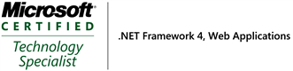

  
  
 

Gerard is a Solution Architect at SSW in Sydney since 2011.

Used to working under pressure, with fourteen years industry experience, he is from the new breed of software architects who are able to combine excellent technical skills with great communication and commercial awareness. Although specialising in Web E-commerce solutions, Gerard has extensive experience in Microsoft.NET and loves working with C#, MVC, SQL Server, JavaScript, Angular JS, Kendo UI and SharePoint.

He graduated from Leeds Metropolitan University with honours in Business Information Systems. His passion is making sure the products we build meet the business needs of the customer. 

As a qualified Professional Scrum Developer, Gerard is capable of working as part of a Scrum Development Team or in the role of Scrum Master. His experience as a Scrum Master covers a wide range of clients and industries including Toll, Vulcan Steel, Carnival Cruises, McDonalds, Sydney Airports, National Australia Day Council and TAFE.

**Vulcan Steel** - Migrate existing back end to Web Services including auto generating clients and documentation. Solution included .NET Async, Swagger, Web API 2, OWIN, Octopus Deploy.  
**FireBootCamp** - Mentor of 9 week full immersion .NET and AngularJS course. Topics included enterprise architecture, SOLID principles, JavaScript, TypeScript, Entity Framework, MVC 5, Web API, Octopus Deploy, Scrum. See [http://firebootcamp.com ](http://firebootcamp.com/)  
**Undisclosed Client** - Designed and implemented enterprise wide ADFS Single Sign On solution encompassing WinForms, Web API and MVC applications. Solution included custom OWIN modules to generate and process JWT bearer tokens.  
**Vulcan Steel **- Anvil ERP System, Mobile App and IntranetUsing AngularJS, MVC 5, Octopus Deploy, TeamCity, Web API, Kendo mobile, Selenium page object pattern, Winforms, SQL Server 2012, Firebird, DDD, jQuery, SharePoint 2013, ADFS  
**Toll Linehaul **- Vehicle Planning and Monitoring SystemUsing MVC 4, Knockout js, Entity framework, Typescript, Kendo UI, Google maps API, SQL Server 2008 R2, Twitter Bootstrap, jQuery, see [http://bit.ly/1hx7NjE](http://bit.ly/1hx7NjE)   
**Pre-Paid Services Pty Ltd** - Barcode Scanning SystemUsing MVC 3, SQL Server 2008 R2. Twitter Bootstrap, jQuery  
**University of Technology Sydney** - TrainingLecturer for .NET MVC course [http://bit.ly/1kb6ma5](http://bit.ly/1kb6ma5) Lecturer for SharePoint course [http://bit.ly/1hEUAPS](http://bit.ly/1hEUAPS)   
**FireBootcamp** - TrainingMentor jQuery and Twitter Bootstrap [http://firebootcamp.com/mentors/ ](http://firebootcamp.com/mentors/)  
**Johnson and Johnson** - SharePoint consultant and SharePoint trainer  
**NSW Fire Service** - MVC 5 trainer  
**Australian Red Cross Blood Service** - On premise TFS upgrade  
**Toll Linehaul** - Fleet Registration SystemScrum Master and developer using MVC 4, Kendo UI, HTML 5, TFS 2012 and VS 2012 for continuous integration.  
**Synchro **- Source ControlUpgraded TFS 2010 to TFS 2012 at Synchro and implemented continuous delivery solution.  
**Sydney Airports** - Tax Calculator to help Sydney Airport investors simplify completing their 2012 tax returns.Scrum Master and developer using MVC 4, Kendo UI, HTML 5. 1st organization to use TFS 2012 and Visual Studio 2012 in a production environment.  
**National Australia Day** - WebsiteScrum Master and back end developer using Umbraco V4.7  
**SSW** - TimeProScrum Master and developer for time sheet project using C# MVC 3, Team Foundation Server 2010, Visual Studio 2010, SQL Server 2008 R2, CRM Dynamics 2011, jQuery, Telerik UI Controls, Kendo UI Controls, Repository Pattern, Dependency Injection using StructureMap, Continuous Integration and Deployment with MSBuild, SQL Reporting Services, SSRS Report Builder 3  
**University of Technology Sydney** - Training  
Delivered SharePoint 2010 CourseTopics included: Administration, Security, Deployment, Business Data Connectivity Services, Forms, Excel Services, Publishing, Work flows, Document Management, Search and Navigation  
Delivered .NET CourseTopics included: MVC, Silverlight, AJAX, jQuery, SQL Server Reporting Services  
**Community**TFS [http://bit.ly/1hnAvT3](http://bit.ly/1hnAvT3) Software estimation [http://bit.ly/1hEWO1Z](http://bit.ly/1hEWO1Z)