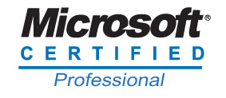
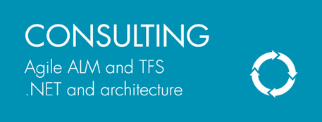

 
  

**Background:**  
Jacky Zhou is a Senior Software Developer at SSW Beijing Office.

He has been working with .Net for 4+ years, with many years experience as a TFS consultant. Specializes in TFS, Agile Training, ASP.NET, Reporting Services, Windows Azure Pack. 

**Work:  
**Jacky Zhou has been a TFS consultant many years and has helped many companies to use TFS and Visual Studio better.   
Some of his major clients include:  
**ABC **( Agriculture Bank of China ) - Help the client use TFS build to achieve automatically build and deployment.  
**Microsoft **- TFS & Agile training, Windows Azure Pack Customization & Extension.  
Other TFS & ALM work experience:   
Helped some clients to use TFS as their REQ Management System and Custom Report for them.  
Helped some clients to upgrade their TFS and SharePoint environment.  
Helped some clients to migrate their repository from (CVS, SVN, GIT, and VSS) to TFS.

#### **Certifications:**

Exam: 70-496 - Administering Microsoft Visual Studio Team Foundation Server 2012  
Exam: 70-498 - Delivering Continuous Value with Visual Studio 2012 Application Lifecycle Management  
Exam: 70-246 - Monitoring and Operating a Private Cloud with System Center 2012  
Exam: 70-247 - Configuring and Deploying a Private Cloud with System Center 2012  
Exam: 70-693 - PRO: Windows Server 2008 R2, Virtualization Administrator  
Exam: 70-410- Installing and Configuring Windows Server 2012