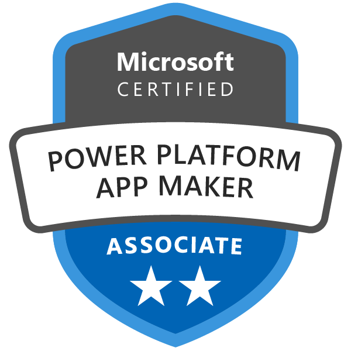

[Editing your profile]: https://github.com/SSWConsulting/People/wiki/3.-Editing-your-profile

[[imgBadge]]
| 

[[imgBadge]]
| 

[[imgBadge]]
| 

Jake is a Software Engineer originally from New Zealand, now working out of Sydney. He now has more than 5 years experience helping companies build great software. He has a wide skillset, including .NET, React, SQL, the Power Platform and Azure.

Jake primarily specialises as a .NET engineer but has recently dedicated significant effort to mastering the Power Platform, showcasing his versatility and commitment to staying current with emerging technologies.

When Jake isn't working you'll find him doing 1 of 5 things: playing football, chess, surfing, in the gym or doing a home project/learning a new tech.
