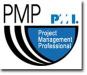

## 
     
  
   
 
 
 

**Background**  

James is a Software Architect in the SSW Beijing office. Since Microsoft .NET Framework 1.1 was released, he has been working on many windows applications and web projects written in C# and VB.NET with SQL Server.   

****

**Work  

**Some of his big projects are :

*   BlueParcel - ASP.NET online shopping web solution 
*   Westlink - ASP.NET web project with SQL Server 2000 database development 
*   Swift - ASP.NET and AJAX web project with SQL Server 2005 database development 
*   Energy Australia - ASP.NET 3.5 Dynamic Data web project with SQL Server 2005 database development 
*   Conquest - Silverlight web project with SQL Server 2008 database development 
James also works on some of SSW products as product manager or developer:

*   [SSW Exchange Reporter](http://www.ssw.com.au/ssw/ExchangeReporter) 
*   [SSW Link Auditor](http://www.ssw.com.au/ssw/LinkAuditor) 
**User Group Presentations **

*   China Beijing .NET User Group - topics about ASP.NET MVC 