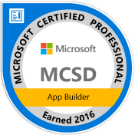
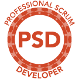
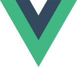

[[imgBadge]]
| 

[[imgBadge]]
| 

[[imgBadge]]
| 

[[imgBadge]]
| 

[[imgBadge]]
| 

[[imgBadge]]
| 

---

Jason Taylor is a passionate developer, architect, trainer and mentor with 20 years of professional experience. He has worked with .NET since 2001, and currently specializes in developing enterprise applications utilizing .NET Core, ASP.NET Core, EF Core, Angular, Vue, and Azure. Jason is an expert on Clean Architecture with .NET Core, and has one of the most sought after GitHub repos containing an awesome template for using Clean Architecture. Jason loves a challenge and is skilled at progressing from a simple proposal into a well-defined, coded, and tested solution.

Since joining SSW in 2016, Jason has worked with many clients to deliver successful solutions using the .NET stack. He has also shared his knowledge and experience with the wider developer community by:

* Speaking at conferences around the world including DDD, NDC and GOTO
* Speaking at .NET User Groups
* Delivering training on .NET Core and Clean Architecture:
  * [.NET Core Dev Superpowers](https://www.ssw.com.au/ssw/Events/Training/NET-Core-Superpowers-Tour.aspx)
  * [Clean Architecture Dev Superpowers](https://www.ssw.com.au/ssw/Events/Training/Clean-Architecture-Superpowers-Tour.aspx)
  * [Clean Architecture 2-day Workshop](https://www.ssw.com.au/ssw/Events/Training/Clean-Architecture-Workshop.aspx)
* Getting involved in community events including:
  * [Angular Hackday](https://angularhackday.com)
  * [DDD Brisbane](https://dddbrisbane.com)
  * [Hack4Good](https://www.youtube.com/watch?v=6B7SywxEiMk)

Jason loves public speaking and has run the Dev Superpowers to sold out audiences in Sydney, Brisbane and Melbourne.

He also runs two very successful open source projects:

* [Clean Architecture Solution Template](https://github.com/jasontaylordev/cleanarchitecture) 
* [Northwind Traders](https://github.com/jasontaylordev/northwindtraders) 

[Click here](https://jasontaylor.dev/speaking/) to view upcoming and past speaking events.
