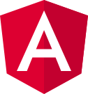
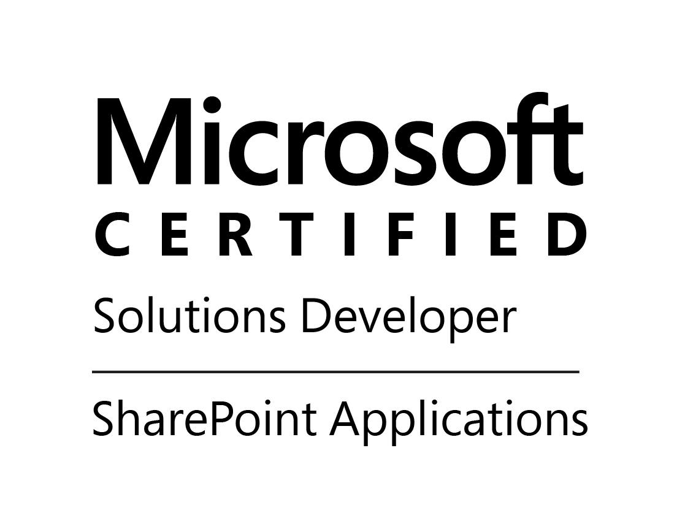
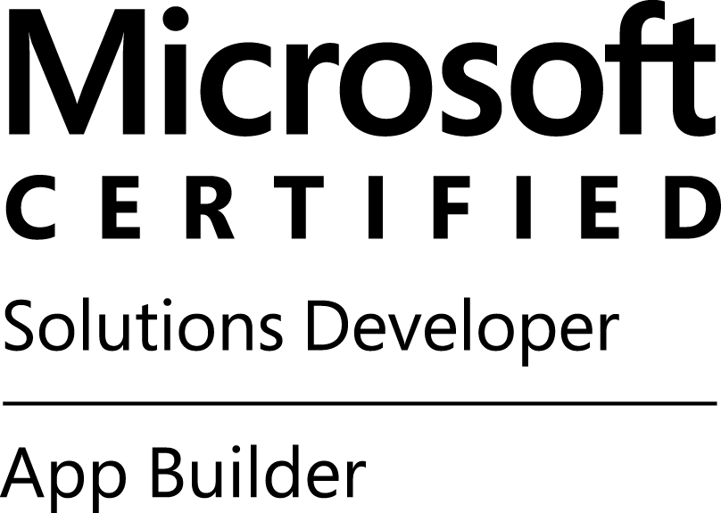
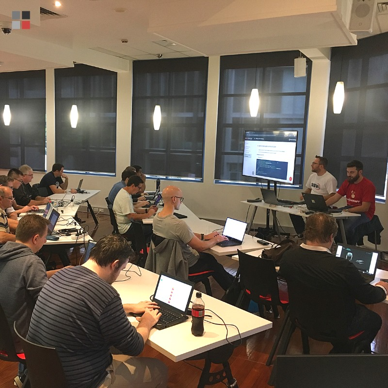

---

 

[[imgBadge]]
| 

[[imgBadge]]
| 

[[imgBadgex14]]
| 

[[imgBadge]]
| 

---

 

Jean is a **SSW Solution Architect**. His main fields of expertise are **SharePoint Applications**, **Angular, React** and **.NET Core**.

His deep knowledge of **SharePoint's** many capabilities, combined with the **latest technologies (Angular, React, SPFx)**, let him propose **high-quality tailored** SharePoint Applications to clients.

Jean has been working with **SharePoint** for the past 7 years, in France, Luxembourg, and now Australia. He has been involved with a wide variety of projects, from **small companies** to **international firms**, in both private and public sectors.

[[imgMd]]
| 
**Figure: Jean and Brendan at the Angular Superpowers Tour - Brisbane**

When he is not leveraging this **knowledge** to develop **client applications**, Jean is one of **SSW's Angular trainers**, running the **[Angular Superpowers Tour](https://www.ssw.com.au/ssw/Events/Training/Angular-Superpowers-Tour.aspx)** and the **[Angular 2 Day Workshop](https://www.ssw.com.au/ssw/Events/Training/Angular-Workshop.aspx)** that travels across Australia.

Jean is highly motivated, with strong technical skills, which allows him to understand and convert complex business requirements into software solutions. He is also able to use his expertise and experience to suggest best practices applicable for any given scenario.

**SharePoint Third Party tools & Add-ons:**

- PNP Libraries & provisioning engine
- SPFX
- Nintex Workflows / MS PowerAutomate
- AvePoint / ShareGate

**Jean's Internal Projects:**

- **[Rules.SSW](https://rules.ssw.com.au/)** - Developed a state of the art new SSW website to take 12,000 ASP.NET pages into a SharePoint public site. This site took advantage of SharePoint’s document management, version control and publishing workflow. This new site gave SSW editors a substantially better experience and their website visitors a better user experience.  
   _Related Technologies: SharePoint, ASP.NET, C#, XML, JQuery, Web Services, TFS and SQL Server._

- **SharePoint intranet** - This SharePoint site is used by all SSW employees to store shared resources and provide project management, internal administrative and global search functionality.  
   _Related Technologies: SharePoint, SPFX, React, C#, Web Services and SQL Server._

#### Video

<iframe width="710" height="400" src="https://www.youtube.com/embed/cEFYB9O1QpI" frameborder="0"></iframe>
