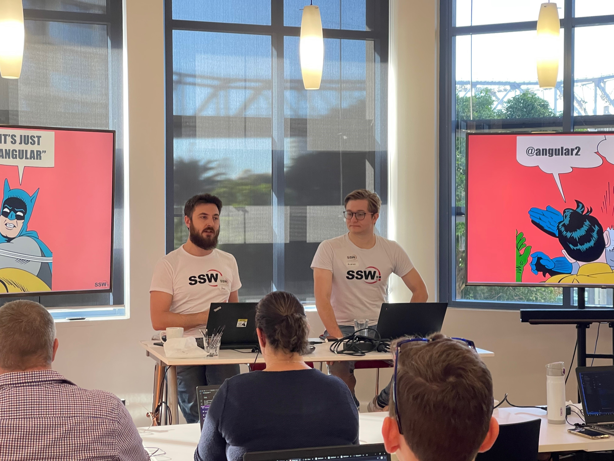

[[imgBadge]]
| 

[[imgBadge]]
| 

[[imgBadge]]
| 

[[imgBadge]]
| 

[[imgBadge]]
| 

[[imgBadge]]
| 

[[imgBadge]]
| 

---

[Book a meeting with me !](https://outlook.office365.com/book/SSWInitialMeetings@sswcom.onmicrosoft.com/s/DX2tn8T_g0yJR68ofa411g2)

Jean Thirion is SSW France CEO, running the European office in Strasbourg, France. As both a business leader and a technical expert, Jean focuses on delivering real value to clients through outcome-driven solutions. With a background in solution architecture and agile delivery, Jean ensures that every engagement stays focused on ROI, adaptability, and long-term business impact. He breaks down silos and fosters ongoing collaboration to keep everyone aligned and focused on delivering real value.

Jean is passionate about building high-performing, awesome teams. He promotes a culture rooted in trust, honesty, and transparency. His approach ensures that everyone —from developers to clients— feels supported, empowered, and heard. Jean strongly advocates for a collaborative and integrated approach, where Product Owners are not just stakeholders but active members of the development team. 

With nearly 15 years in the software industry, Jean has built his career across France, Luxembourg, and spent 8 years in Australia, gaining deep insight into both local and global business environments. With his multilingual skills and cross-cultural mindset, he has led large-scale domestic and international projects, and is particularly passionate about acting as the bridge between technology and business. He has a proven track record delivering scalable, business-critical solutions across both public and private sectors, with a strong focus on the Insurance industry.

On the technical side, Jean is a **SSW Solution Architect**, with deep expertise in **SharePoint Applications**, **Angular**, **React**, **.NET**, and** Microsoft Azure**. His mastery of SharePoint’s capabilities, combined with modern technologies like SPFx and a strong command of Azure Services enables him to deliver high-quality, scalable, and tailored applications. 

[[imgLg]]
| 

Man of many hats, Jean is also one of **SSW's Angular trainers**, running the **[Angular Superpowers Tour](https://www.ssw.com.au/ssw/Events/Training/Angular-Superpowers-Tour.aspx)** and the **[Angular 2-day Workshop](https://www.ssw.com.au/ssw/Events/Training/Angular-Workshop.aspx)** that travels across Australia.

Jean is highly motivated, with strong technical skills, which allows him to understand and convert complex business requirements into software solutions. He is also able to use his expertise and experience to suggest best practices applicable for any given scenario.

**Jean's internal projects:**

- **[SSW.Rules](https://rules.ssw.com.au/)** - Developed a state of the art new SSW website to take 12,000 ASP.NET pages into a SharePoint public site. This site took advantage of SharePoint’s document management, version control and publishing workflow. This new site gave SSW editors a substantially better experience and their website visitors a better user experience.  
   _Related Technologies: SharePoint, ASP.NET, C#, XML, JQuery, Web Services, TFS and SQL Server._

- **SharePoint intranet** - This SharePoint site is used by all SSW employees to store shared resources and provide project management, internal administrative and global search functionality.  
   _Related Technologies: SharePoint, SPFX, React, C#, Web Services and SQL Server._

- **EasyLeave** - Leave request platform, integrated into Timesheeting/Invoicing system (TimePro) 
  _Product page: https://sswtimepro.com/_
  _YouTube channel: https://www.youtube.com/@sswtimepro/videos_
  _Related Technologies: .NET, EF, Angular 19, Modular Monolith_

#### Videos

<iframe width="710" height="400" src="https://www.youtube.com/embed/Mna0QBFB6CU" frameborder="0"></iframe>

---

<iframe width="710" height="400" src="https://www.youtube.com/embed/cEFYB9O1QpI" frameborder="0"></iframe>
