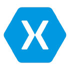
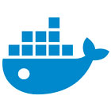

  
 
  
  
  
  
  
   

With 10 years of experience in software engineering across multiple industries like Museums, Government, Banks, gaming, entertainment, Jernej has worked on full stack development of native applications from mobile to desktop applications.

JK loves working on Angular, .NET Core, and cognitive service and his most recent projects have featured Docker and AKS (Azure Kubernetes Services). He now loves containers and sees everything as a container!  

He is often a contributor, preparing developers for their SSW TV presentations and even gets in front of the camera sometimes [https://tv.ssw.com/tag/jernej-kavka](https://tv.ssw.com/tag/jernej-kavka) and [Personal YouTube](https://www.youtube.com/watch?v=3VPHV1902OQ&list=PLO0Fq_pphtfEHluXtyaX-IYy4vV2QxYeS) or at events like [Global Azure Bootcamp ](https://global.azurebootcamp.net/)or [DDD](https://dddbrisbane.com/). He also actively supports .NET Community as a [.NET Foundation member](https://dotnetfoundation.org/) (one of the first 200 members!) and is a backer for several Open Source projects on [Open Collective](https://opencollective.com/jernej-kavka).  

You can also follow me on [Twitter ](https://twitter.com/jernej_kavka)and [my personal dev blog](https://jkdev.me/).  
You can find his schedule for the next presentation on [Sessionize](https://sessionize.com/jernej-kavka/).  

Jernej is proficient on Windows platform development from legacy applications (using C#, WinForms, WPF, ...) to modern applications (Windows Store and Windows Universal applications, Xamarin ) but also has experience developing Web Applications using MVC, Angular, jQuery, CSS, HTML5, etc. Lately, he's sharpening his skills with cognitive services as well as machine learning.

Jernej's client projects include:  
<table class="ms-rteTable-default" width="100%" cellspacing="0" style="height:146px;"><tbody><tr class="ms-rteTableEvenRow-default"><td class="ms-rteTableEvenCol-default" style="width:165px;height:36px;text-align:center;"> 
  

       </td><td class="ms-rteTableOddCol-default" style="width:673px;height:36px;">
       **Infomedia**  
Infomedia needed to upgrade their applications to a newer version of the Angular framework and improve the overall performance of their applications.  

**Related Technology**: Angular, TypeScript  

</td></tr><tr class="ms-rteTableOddRow-default"><td class="ms-rteTableEvenCol-default" rowspan="1" style="width:165px;height:36px;text-align:center;"> 
  

</td><td class="ms-rteTableOddCol-default" rowspan="1" style="width:673px;height:36px;">

  <strong class="ms-rteThemeForeColor-2-0">Long Service Corporation**  
Long Service Corporation engaged SSW to redesign and refactor their Worker Portal application, used by workers to download their statements. This application will be extended to include claims for workers. The new software design of the application includes multiple services which can be shared between projects.

 **Related Technology**: ASP.Net MVC, Entity Framework, WebAPI, TypeScript, jQuery  

</strong></td></tr><tr class="ms-rteTableFooterRow-default"><td class="ms-rteTableFooterEvenCol-default" rowspan="1" style="width:165px;height:36px;text-align:center;"> 
</td><td class="ms-rteTableFooterOddCol-default" rowspan="1" style="width:673px;height:36px;">**Banpu**  
Banpu engaged SSW to develop a PWA application that can be used online and offline in various situations. We have worked with several different teams from different countries and parts of Australia, and the main focus for SSW was delivering micro-services, offline and syncing capabilities of the PWA application, a desktop administration website, the mobile UX animations, and migrating data from Excel spreadsheets. We delivered all of the features with high code coverage with unit and component tests.  

**Related Technology**: React, PWA, CosmosDB, NodeJS, .NET Core  
</td></tr></tbody></table>  

Jernej's internal projects include:  
<table class="ms-rteTable-default" cellspacing="0" style="width:100%;"><tbody><tr><td class="ms-rteTable-default" style="width:1%;text-align:center;"> 
  
</td><td class="ms-rteTable-default" style="width:50%;">
       **SSW ****Time****Pro **-** **Timesheeting and invoicing application that integrates with CRM and TFS servers.  

**Related Technology**: Angular, TypeScript, MVC 5, SQL Server 2012, jQuery, WebAPI, Kendo UI  
</td></tr><tr><td class="ms-rteTable-default" style="width:1%;text-align:center;"> 
</td><td class="ms-rteTable-default">**SugarLearning** is a simple induction training website used to get new employees up to speed and track their progress.  

**Related Technology**: Angular, TypeScript, MVC 5, SQL Server 2012, jQuery, WebAPI, Kendo UI   
</td></tr><tr><td> 
  
</td><td> 
       **Sophie** is a smart receptionist that recognizes incoming guests and lets them know about their agenda and information relevant to them. In the future, Sophie will be used a full smart office solution.  

**Related Technology: **React, .NET Core, SignalR, Cognitive Services, Azure Bots, Azure Functions  
</td></tr></tbody></table>