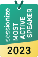

[[imgBadge]]
| 

[[imgBadge]]
| 

[[imgBadge]]
| 

[[imgBadge]]
| 

[[imgBadge]]
| 

[[imgBadge]]
| 

[[imgBadge]]
| 

[[imgBadge]]
| 

[[imgBadge]]
| 

[[imgBadge]]
| 

[[imgBadge]]
| 

[[imgBadge]]
| 

[[imgBadge]]
| 

[[imgBadge]]
| 

[[imgBadge]]
| 

[[imgBadge]]
| 

[[imgBadge]]
| 

---

Jernej Kavka (JK) is a **Microsoft MVP** and **Solution Architect** at SSW, bringing over 15 years of experience in full-stack .NET development, solution architecture, and AI integration across industries including insurance, banking, mining, auctions, and entertainment. JK is passionate about modern application development with .NET Core, EF Core, and AI, and is dedicated to mentoring and knowledge sharing.

With expertise in ASP.NET Core, Angular, and Azure DevOps, JK is also skilled in Windows platform development, transforming legacy applications (using C#, WinForms, and WPF) into modern solutions with Windows Store, UWP, and Xamarin. As a Microsoft AI MVP, he frequently develops AI-driven solutions using tools like Azure OpenAI, small language models (SLMs) for offline AI, and retrieval-augmented generation (RAG) systems. JK’s work philosophy emphasizes delivering solutions that empower teams, streamline processes, and ensure sustainable client success.

## Performance and Stability of Applications

JK specializes in diagnosing and resolving performance and stability issues across various technologies like .NET, EF Core, SQL Server and Azure. From optimizing SQL queries to enhancing Azure resource efficiency, JK not only resolves issues but also teaches teams the root causes and preventive measures for lasting improvements.

## Solution Architecture

With a unique problem-solving perspective, JK identifies innovative solutions for complex challenges. He has extensive experience with Azure App Service, Function Apps, SignalR, Storage, Logic Apps, Static Web Apps, Azure SQL and Application Insights.

## Community Contributions and Mentoring

- **Organizer**: Hosts events like **Brisbane AI User Group** and **AI Hack Day**
- **Podcaster**: Co-host of **Global AI: The Podcast**, exploring AI's impact across industries
- **Presenter**: An international speaker at conferences such as **[NDC](https://ndcsydney.com)**, **[Global Azure Bootcamp](https://global.azurebootcamp.net)**, **[Brisbane Data Analytics & AI Bootcamp](https://brisbanebootcamp.com)**, **[DDD](https://dddbrisbane.com)**, **[Level Up Your Data](https://levelupyourdata.com)**, and more. JK is a frequent contributor to **[SSW TV](https://tv.ssw.com/tag/jernej-kavka)**.
- **Mentor**: Guides developers on leveraging AI, improving code architecture, and enhancing performance within their projects
- **Most Active Speaker**: Recognized by **[Sessionize](https://sessionize.com/jernej-kavka)** as among the top 3% of most active presenters in 2023

You can follow JK on **[GitHub](https://github.com/jernejk)**, **[Twitter](https://twitter.com/jernej_kavka)**, **[his personal blog](https://jkdev.me)**, or check his next speaking engagement on **[Sessionize](https://sessionize.com/jernej-kavka)**.

`youtube: https://www.youtube.com/embed/35qt4DexxuE`
