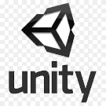
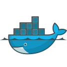
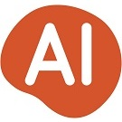
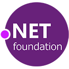
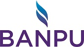

 

[[imgBadge]]
| 

[[imgBadge]]
| 

[[imgBadge]]
| 

[[imgBadge]]
| 

[[imgBadge]]
| 

[[imgBadge]]
| 

[[imgBadge]]
| 

[[imgBadge]]
| 

[[imgBadge]]
| 

[[imgBadge]]
| 

[[imgBadge]]
| 

[[imgBadge]]
| 

[[imgBadge]]
| 

[[imgBadge]]
| 

---

 

Jernej Kavka (JK) is an SSW Solution Architect, Microsoft AI MVP and organizer of the Brisbane AI user group. JK is a full-stack .NET developer, but his passion lies in Azure Cognitive Services, AI and machine learning. He is the main architect behind SSW's virtual receptionist - SSW SophieBot and SSW SophieHub: https://sswsophie.com

JK loves working on Blazor, Angular, .NET Core, and Cognitive Services. His most recent projects have featured Docker, AKS (Azure Kubernetes Services) and Machine Learning development. He loves containers and Kubernetes and enjoys showing others the immense possibilities that Container technology has to offer.

In addition to being an expert in ASP, .NET Core, Angular, and Azure DevOps, Jernej is also proficient on Windows platform development from legacy applications (using C#, WinForms, WPF, …) changing them into modern applications (using Windows Store, Windows Universal applications, and Xamarin). Lately, he's sharpening his skills with Cognitive Services as well as Machine Learning.

JK is a technology thought leader and frequent contributor to technical presentations. He likes to help prepare developers for SSW TV presentations and even gets in front of the camera sometimes. You can see his latest work here: [**SSW TV**](https://tv.ssw.com/tag/jernej-kavka) and [**Personal YouTube**](https://youtube.com/channel/UCige1JIdeIc3sYU2HSaismg) or at events like [**Global Azure Bootcamp**](https://global.azurebootcamp.net/), [**Global AI Bootcamp**](https://brisbanebootcamp.com), [**DDD**](https://dddbrisbane.com/) ([**Brisbane**](https://dddbrisbane.com/) , [**Melbourne**](https://www.dddmelbourne.com) , and [ **Sydney**](https://www.dddsydney.com.au) ), and [**NDC**](https://ndcsydney.com/). JK is equally likely to attend a conference/user group as he is to present at one. 🧐

JK also actively supports the .NET Community as a [**.NET Foundation member**](https://dotnetfoundation.org/) (one of the first 200 members!), is a backer for several Open Source projects on [**Open Collective**](https://opencollective.com/jernej-kavka) and organizer of [**Brisbane AI User Group**](https://www.meetup.com/Brisbane-AI-User-Group/).

You can follow him on [**Twitter,**](https://twitter.com/jernej_kavka), [**his personal blog**](https://jkdev.me/) or check out when is his next talk on [**Sessionize**](https://sessionize.com/jernej-kavka/).

`youtube:  https://www.youtube.com/embed/35qt4DexxuE`

Jernej's client projects include:

[[imgSm]]
| 

**Allianz Australia** - The project focus was building a B2B and B2C web application using micro-services, and service buses, using Angular with ngrx and .NET Core.

Additionally, we were responsible for developing systems for 3rd parties to integrate with, creating a  flexible website that can display dynamic content for Allianz partners.

**Related Technologies**: Angular with ngrx, .NET Core, EF Core, NService Bus

---

[[imgSm]]
| 

**Banpu** engaged SSW to develop a PWA application that can be used online and offline in various situations. We have worked with several different teams from different countries and parts of Australia, and the main focus for SSW was delivering micro-services, offline and syncing capabilities of the PWA application, a desktop administration website, the mobile UX animations, and migrating data from Excel spreadsheets. We delivered all of the features with high code coverage with unit and component tests.

**Related Technologies**: React, PWA, CosmosDB, NodeJS, .NET Core

---

[[imgSm]]
| 

**Long Service Corporation** engaged SSW to redesign and refactor their Worker Portal application, used by workers to download their statements. This application will be extended to include claims for workers. The new software design of the application includes multiple services that can be shared between projects.

**Related Technologies**: ASP.Net MVC, Entity Framework, WebAPI, TypeScript, jQuery

---

[[imgSm]]
| 

**Infomedia** - The project consisted of upgrading applications to a newer version of the Angular framework which resulted in improving the overall application performance for users.

**Related Technologies**: Angular, TypeScript

Jernej's internal projects include:

---

[[imgSm]]
| 

**Sophie Bot** is an essential part of SSW smart office solution where employees can check who’s in the office, see others' availability, and many more features.See more information at [sswsophie.com/sophiebot](https://sswsophie.com/sophiebot)

**Related Technology**: React, .NET Core, SignalR, Cognitive Services, Azure Bots, Azure Functions

---

[[imgSm]]
| 

**Sophie Hub** is a smart receptionist that recognizes incoming guests and lets them know about their agenda and information relevant to them. In the future, Sophie will be used as a full smart office solution.

Check out [sswsophie.com](https://sswsophie.com/) for more information.

**Related Technology**: Google DialogFlow, Azure Functions, Google Firebase, CRM, Office365

---

[[imgSm]]
| 

**SSW Time Pro** - Timesheeting and invoicing application that integrates with CRM and TFS servers.

**Related Technology**: Angular, TypeScript, MVC, SQL Server 2017, jQuery, WebAPI, Kendo UI

---

[[imgSm]]
| 

**SugarLearning** is a simple induction training website used to get new employees up to speed and track their progress.

**Related Technology**: Angular, TypeScript, MVC, Azure SQL Server, WebAPI, Kendo UI
