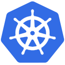

--- 
id: "3c0070eb-9d2d-ed11-9db1-00224818a8c8" 

qualifications: ""

quote: "You can never be overdressed or overeducated."
quoteAuthor: "Oscar Wilde"
---
[[imgBadge]]
| 

[[imgBadge]]
| 

[[imgBadge]]
| 

[[imgBadge]]
| 

[[imgBadge]]
| 

[[imgBadge]]
| 

[[imgBadge]]
| 

[[imgBadge]]
| 

[[imgBadge]]
| 

[[imgBadge]]
| 

[[imgBadge]]
| 

John is a **Software Engineer** based in SSW Hangzhou. John has extensive experience building applications across multiple platforms with the most profound and industry-recognized technologies.

He strives to design robust, applicable and maintainable software, following industry best practices, and he dedicates himself to developing his skills to provide the most professional and resourceful services.
John has worked in several IT companies around the world and has rich experience implementing micro front-ends, PowerBI, and IoT projects.

## Development Technologies
His technology toolbelt includes:
* Azure DevOps
* GitHub
* ASP.NET Core
* Clean Architecture
* NestJS
* React
* Vue
* Angular
* Next.js
* Blazor
* Tailwind
* Docker
* Kubernetes
and more...
