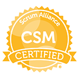

[[imgBadge]]
| 
[[imgBadge]]
| 
[[imgBadge]]
| 
[[imgBadge]]
| 
[[imgBadge]]
| 
[[imgBadge]]
| 
[[imgBadge]]
| 

Kiki is SSW's VP of Security & Infrastructure, leading the team responsible for keeping SSW's systems secure and reliable while continuing to improve how things are done. He is still very hands-on technically, and over the years has taken plenty of processes from horse and carriage to something much more Tesla-like, usually with PowerShell, automation and a bit of creative problem solving.

With a Bachelor's Degree in Computer Science and a background in Customer Experience, Kiki has always had one foot in the technical side and the other in helping people get better outcomes from technology. These days that also means leading the team, helping make technical decisions, mentoring others and taking ownership of the projects that are difficult, messy or don't fit neatly into one area.

His work covers Azure, Microsoft 365, Entra ID, Intune, Windows Server, networking, security, PowerShell and automation. He has also led projects that go well beyond traditional infrastructure, including smart building systems with Home Assistant, security improvements across SSW, and practical ways of adopting AI without creating unnecessary risk.

Kiki is usually happiest when there is a hard problem to solve, especially one that needs both technical depth and a bit of leadership to get it over the line. His goal is simple: make technology work better for the people relying on it.
