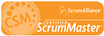

 
[[imgBadge]]
|  
  
[[imgBadge]]
|  

[[imgBadge]]
|  

[[imgBadge]]
|  

[[imgBadge]]
|  

 **Background**
 Lei Xu is a Senior Software Architect at SSW, a Microsoft Certified Partner specialising in .NET solutions. He specializes in developing solutions with C#, VB.NET, ASP.NET, WinForms, WPF/WCF/WF, Windows Services, Reporting Services, SQL Server and Exchange Server. Lei is one of the few to work in both the Sydney and Beijing offices. Lei has been running the Beijing office since 2005 - so he is in charge of the day to day operation of the office, but spends most of his time taking the lead in the technical directions.  

 **Work** 
 Lei has been a Microsoft Most Valuable Professional (MVP) for many years (since 2006). In fact his MVP specialities have crossed many technologies:

*   Initially in Windows Networking (2006-2007) 
*   Then in Windows Desktop Experience (2007-2008) 
*   Currently in Visual Studio Team System (VSTS) and Team Foundation Server (TFS) (since 2008) 

He ran the Windows Vista Compatibility Testing Program for Microsoft China for over 2 years, starting as soon as Windows Vista’s RTM'ed in 2006. Many of the leading software vendors in Australia and China have benefited by getting their products certified and working perfectly with Windows Vista. Some of the companies that have benefited from Lei are PowerWord (KingSoft), QQ (Tencent), LeiYi (Yahoo China), Wopti Utilities and many more. Now Lei has worked with more than 200 software applications, to ensure 100% Windows 7 Compatibility Testing and Support.

Some of his major clients include:

*   Microsoft China: working with Microsoft China DPE in the past 3 years on Windows Vista Logo Program, Windows Server 2008 Developement Jumpstart training, Windows 7 Compatibility Testing & Support, VSTS Real World Training, TechEd 2008, Performance Testing etc. 
*   Westlink: as the project manager of this long term major client of SSW, Lei is leading his team to provide the best consulting services to help them maintain their existing system as well as develop new features, and most importantly helping the client to discover new business possibilities. 

Some of his major internal work includes:

*   SSW Exchange Reporter: the best selling product of SSW. Lei has been the major developer behind this product and helped hunderds of clients around the world in their complex Exchange system to install this tool and extract valuable information from their huge databases. 
*   SSW Link Auditor: SSW's award winning SEO and website maintenance tool to help web masters to find out bad links on their website, and also help them to improve their Google ranking. Lei has been one of the major developers behind this tool and he was the one who started running this tool on SSW's own 12,000 pages. 
*   SSW Agile Template: SSW's customization of MSF Agile Process Template, which eventually helped SSW to move the project management process on top of VSTS.    

**Passion**  
Lei is also a TechEd speaker and a frequent speaker at Microsoft (Beijing) .NET User Group, he is working closely with the management team of the .NET User Group to deliver many award winning courses covering cutting edge technologies, such as .NET Framework 3.0/3.5 (WCF/WF/WPF), Silverlight, SQL Server 2005/2008, SQL Reporting Services, IE 8.0, Windows Vista and Windows Server 2008.

**Future Goals**  
Right now, Lei's goals are:

*   Improving the project management processes by utilizing Visual Studio Team System and Team Foundation Server even more. 
*   Delivering more business solutions while using [SSW Agile Development Processes](https://ssw.com.au/rules/rules-to-successful-projects) 

