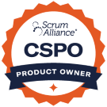

[[imgBadge]]
| 

[[imgBadge]]
| 

---
[Click here to book a meeting with me](https://outlook.office.com/bookwithme/user/bbcb9e1713ed4887a30e3e95a9ffb3ba@ssw.com.au/meetingtype/SVRwCe7HMUGxuT6WGxi68g2?anonymous&ep=mlink)

As SSW’s VP of Operations and an Account Manager, Levi plays a key role in Business Development, Sales, and Operations. He collaborates closely with the SSW sales and operations teams to drive growth and ensure seamless project delivery for our NSW and International clients. His passion for business development and technology fuels his “out of the box” approach to problem-solving.

**Project Involvement**

Levi is actively involved from the beginning of each project. He leads the kickoff meeting to understand your company’s requirements and identify the best developers for your project. From there, Levi’s team creates a comprehensive project plan, known as the Specification Review. This document serves as a roadmap, guiding our Solution Architects and production team through each stage of the project, with Levi ensuring smooth execution and open communication along the way.

**Product Developement: TinaCMS**

In addition to his operational responsibilities, Levi contributes to the ongoing development of TinaCMS, the world’s best Markdown website editor - [TinaCMS](https://tina.io/).

**Personal Interests**

Outside of work, Levi is an avid traveler, exploring different cultures and cuisines around the world. He’s also fascinated by AI and frequently utilizes tools like ChatGPT. A passionate car enthusiast, Levi enjoys the challenge and reward of assembling and testing engines.
