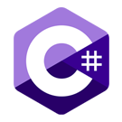
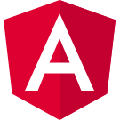
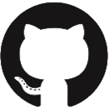
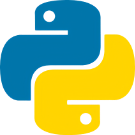

[[imgBadge]]
| 

[[imgBadge]]
| 

[[imgBadge]]
| 

[[imgBadge]]
| 

[[imgBadge]]
| 

[[imgBadge]]
| 

[[imgBadge]]
| 

---

Lewis is a **Software Developer** based in the SSW Sydney office, specialising in AI-powered application development. He holds a Bachelor of Computer Science from the University of New South Wales and is a graduate of SSW's [FireBootCamp](https://www.ssw.com.au/events/firebootcamp).

Lewis works across the full stack and has experience integrating modern AI capabilities into real-world applications, including LLM-based workflows, prompt engineering, MCP-powered extensibility, and Azure OpenAI deployments. He served as the Scrum Master for [YakShaver](https://yakshaver.ai), leading the team through sprints, planning, and delivery. He is now part of the SSW.AI team, working on various internal AI projects within the company.

## Internal Projects

### [FireBootCamp](https://www.ssw.com.au/events/firebootcamp)

Lewis is a FireBootCamp graduate who now runs the program — training the next generation of developers in .NET, SQL, and Angular.

### [YakShaver](https://yakshaver.ai)

Lewis was the Scrum Master and a core developer on **[YakShaver](https://yakshaver.ai)**, an AI-powered tool that transforms screen recordings into fully formatted backlog items across GitHub, Azure DevOps, and Jira. Users simply record their screen and voice describing an issue or feature, and YakShaver handles the transcription, AI processing, and work item generation — reducing issue reporting time by approximately 90%.

Lewis integrated Dynamics 365 as a data source, enabling companies to pull their people and project data directly from Dynamics into YakShaver for smarter work item assignment and team management.

Relevant technologies: Next.js, .NET, Electron, SQL, Azure

### SSW.AI

Lewis is currently part of the SSW.AI team, contributing to a range of internal AI projects that drive innovation and productivity across the company. The team focuses on building and improving AI-powered tools and workflows used by SSW staff and clients.

## Videos

`youtube: https://www.youtube.com/watch?v=b3nL3o1V8u4`

`youtube: https://www.youtube.com/watch?v=YJSEgbK4xqw`

Outside of Software Development, Lewis enjoys playing Table Tennis and Badminton with friends, and likes playing Rhythm Games in his own time.
