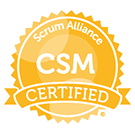

[[imgBadge]]
| 

Lindsay has worked with many organizations from tech start-ups to multi-nationals to help them achieve their growth ambitions and empowers SSW customers to continue their growth stories both in Australia and internationally.  

 With a proven track record of successful strategy development and execution across a range of sectors including IT, retail, logistics and manufacturing, Lindsay can help you build your brand and execute your growth strategies in complex market environments.  

 Lindsay specialises in:  

 - Strategic Planning and Execution 

 - Operational Management

 - Program Management & Scrum Facilitation