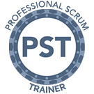

  
  

##  
[[imgBadge]]
|  

As one of the smartest guys at SSW, Mark is the man to go to for any .NET related issue. He's the one that others come to when they get stuck.  

Mark is a Solution Architect at SSW, a Microsoft Certified Professional specialising in .NET Solutions. He is experienced in developing solutions with C#, ASP.NET, Web Services, SQL Server, Microsoft Office Integration and SharePoint customization.

Mark's client projects:

*   **Aurecon** 

An intranet portal used to collaborate and share knowledge between different engineering groups.  
Related Technology: Office SharePoint 2007 
*   **
    **WorleyParsons - IoP**** 

An extranet portal that defines different work processes used by WorleyParsons and their partners. SSW assist in structuring the site and building custom web parts to provide two-way links between pages to assist navigation.  
Related Technology: Office SharePoint 2007
*   **Portfolio Business Technology** 

A PowerPoint add-in that helps users to create engaging presentation with multimedia capabilities.  
Related Technology: C#, Office Add-in
*   **Powertel Pty Ltd** 

A DSL provisioning system supporting over 100,000 ADSL subscribers.  
Related Technology: SQL Server 2005, SSIS, C#, DTS, Virtualisation and Access 2003.
*   **Commonwealth Bank's CommTrack Application** 

A time tracking application used to capture activities of a user, and demands and work in progress of a team.  
Related Technology: C#, VB.NET, Web Services, Javascripts, ASP.NET 1.1 and SQL Server 2000.
*   **Suntory Cocktail Menu Builder** 

A Windows Form application that creates a pdf menu based on designer templates.  
Related Technology: C#, Windows Form, ClickOnce and SQL Server 2000 with replication.
*   **System77 Point of Sale** 

A client application that connects to System77's backend through Web Services.  
Related Technology: C#, Windows Form and Web Services.
*   **Online client portal, Forex Group** 

A web application that lets client place and keep track of orders online.  
Related Technology: VB.NET, ASP.NET 2.0 and SQL Server 2000.
*   **RCW, Vero** 

An Access application used to manage construction insurance policies, invoices, and customer entities.  
Related Technology: Access 2000, C# and SQL Server 2000.

Mark's internal projects:

*   **SSW Time PRO .NET** Time sheeting application that supports both direct database connection and Web Services.  
Related Technology: C#, VB.NET, Windows Form, Web Service, Windows Communication Foundation and SQL Server 2005.
*   **SSW Code Auditor** A powerful code auditing engine that support multiple rule types (such as Regular Expressions, wild cards, and code snippets) and multiple target types (such as Visual Studio projects, Mirosoft Access Project, and website outputs)  
Related Technology: C#, Windows Form, Regular Expression, XML, XSL and Microsoft Access database

Mark's personal projects:

*   **Raid Point** A web application that uses zero-sum point system to keep track of his World of Warcraft's guild progression.  
Related Technology: C#, ASP.NET 2.0, SQL Server 2000

His favourite quote is *"Sometimes I dream that a big, giant squirrel is carrying me away. Does that make me a nut?". *

##### Mark is bi-lingual, speaking C# and VB .NET