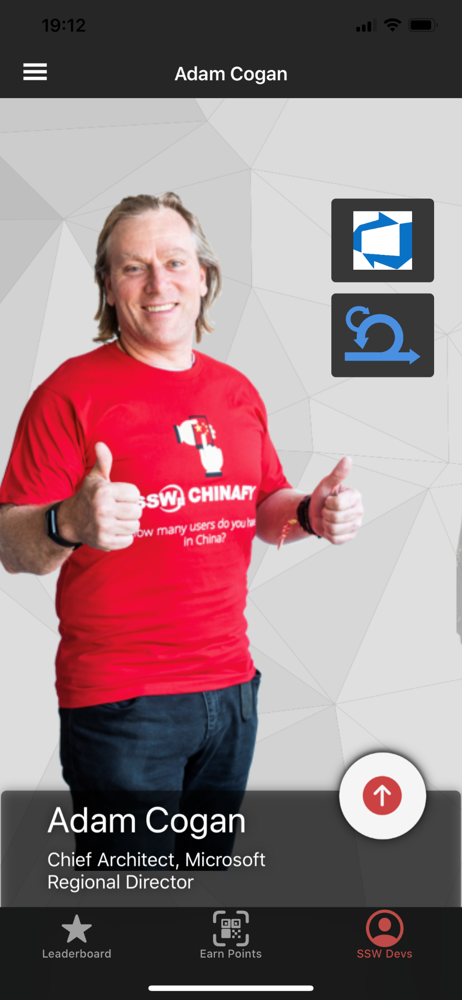

Drawing on a combination of hands-on experience and enterprise governance practices, Matt is able to make connections between business and technology to deliver user and business focused outcomes.

Matt has worked in IT for 15 years, with a background in infrastructure and management, and has delivered security policies, IT strategies and disaster recovery plans to a number of high profile national and multi-national clients.   

Throughout his career Matt has enjoyed scripting and programming and used these skills to enhance his work in other areas, but has now turned to developing software full-time, specialising in .NET Core, Angular, Xamarin and Azure as well as security and authentication.

## Internal Projects

### [SSW.Rewards](https://apps.apple.com/au/app/ssw-rewards/id1482994853)

[[imgLg]]
| 

Matt built SSW's Rewards mobile app in Xamarin.Forms to help [gamify SSW's swag](https://adamcogan.com/2019/11/06/ssw-had-fun-at-ndc-gotta-catch-em-all/) for NDC Sydney in 2019.

The app enables the developer community to connect with SSW devs at conferences and user group events, as well as accumulate points by scanning QR codes and ultimately winning prizes. It also features a tech quiz that let's developer test themselves. Matt also worked with the team on the backend of the app, and the entire product was built and released in under two weeks.

Relevant technologies: .NET Core, Azure Functions, Azure AD B2C, Xamarin