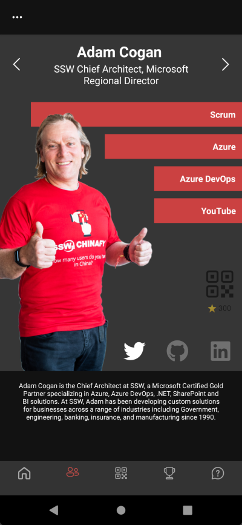
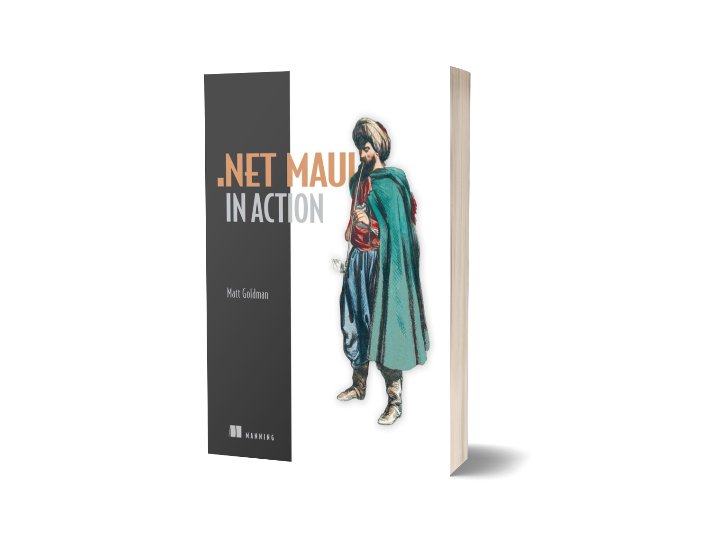

[[imgBadge]]
| 

[[imgBadge]]
| 

[[imgBadge]]
| 

[[imgBadge]]
| 

[[imgBadge]]
| 

[[imgBadge]]
| 

[[imgBadge]]
| 

[[imgBadge]]
| 

[[imgBadge]]
| 

[[imgBadge]]
| 

## Matt Goldman: Solution Architect | Scrum Master | Innovator | Author

## About me

With a rich background in systems engineering and management, complemented by a profound passion for software development, I thrive at the intersection of innovation, strategy, and creation. My professional path is distinguished by relentless innovation, a dedication to clear and impactful communication, and a zeal for problem-solving that transcends the workspace into my personal passions.

## What I Do

* **Innovate with Purpose:** From crafting secure authentication systems for educational clients to enhancing app engagement with AI, my aim is always to deliver solutions that marry innovation with user-centric design.
* **Bridge Gaps:** Beyond technical development, I excel in translating complex concepts into digestible insights, creating a synergy between technical and non-technical teams towards shared objectives.
* **Inspire and Educate:** Through my book, _[.NET MAUI in Action](https://www.manning.com/books/dot-net-maui-in-action?utm_source=goforgoldman&utm_medium=affiliate&utm_campaign=book_goldman_dot_5_10_22&a_aid=goforgoldman&a_bid=38933097)_, I share my expertise and experiences, aiming to empower and guide the developer community in leveraging .NET to its full potential.

## Projects & Achievements

* **Secure Authentication System:** Lead the design and development of a novel authentication system, using the Device Code Flow and an original NFC based system, prioritising user privacy without sacrificing convenience.
* **SSW Rewards App:** Lead the development of [SSW's showcase Rewards app](https://www.ssw.com.au/products/rewards), and recently introduced a groundbreaking AI-powered quiz engine, redefining user interaction and fairness within digital platforms.

[[imgMd]]
| 

* **.NET MAUI in Action:** Authored a [comprehensive guide to .NET MAUI](https://www.manning.com/books/dot-net-maui-in-action?utm_source=goforgoldman&utm_medium=affiliate&utm_campaign=book_goldman_dot_5_10_22&a_aid=goforgoldman&a_bid=38933097), contributing to the knowledge base of the .NET community and supporting developers in mastering this versatile framework.

[[imgLg]]
| 

## Skills & Expertise

* **Technologies:** .NET, Xamarin/.NET MAUI, security/authentication, AI applications, and crafting secure, user-friendly systems.
* **Communication:** Adept at demystifying technical challenges, promoting understanding and action across diverse groups.
* **Leadership and Collaboration:** Demonstrated success in leading projects that require high levels of cooperation, creativity, and technical skill.

## Engagement & Community

Co-founder and co-host of the Beer Driven Devs podcast, I explore the intersection of technology, innovation, and brewing, engaging with a wide audience on the latest in tech. An active participant in the tech community, I enjoy sharing insights at conferences, user groups, and through various online platforms.

## Looking Forward

I'm continually drawn to projects that push boundaries and foster new possibilities. If you're seeking a collaborator who blends innovative technical solutions with strategic insight and real-world applicability, let's connect and create something impactful together.
