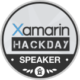
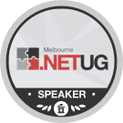
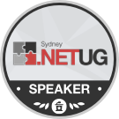
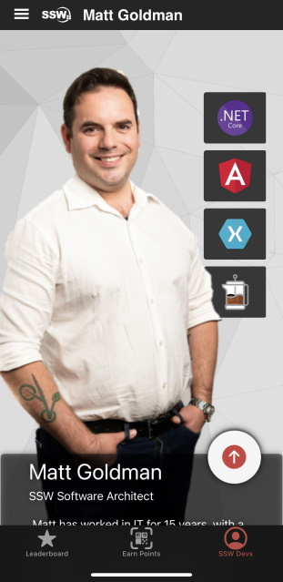

[[imgBadge]]
| 

[[imgBadge]]
| 

[[imgBadge]]
| 

[[imgBadge]]
| 

[[imgBadge]]
| 

[[imgBadge]]
| 

[[imgBadge]]
| 

[[imgBadge]]
| 

[[imgBadge]]
| 

[[imgBadge]]
| 

Matt is a Solution Architect, Scrum Master, public speaker, author and trainer.

Since joining SSW, Matt has worked on a number of projects for a range of clients, including government agencies and multinational organisations. Matt loves making things, and at SSW uses that passion to fuel his work with .NET, EF / EF Core, Xamarin and .NET MAUI, Azure and Blazor. Matt also works with security and authentication/authorisation. Additionally, Matt [(author of .NET MAUI in Action)](https://www.manning.com/books/dot-net-maui-in-action?utm_source=goforgoldman&utm_medium=affiliate&utm_campaign=book_goldman_dot_5_10_22&a_aid=goforgoldman&a_bid=38933097) regularly presents at the [.NET User Group](https://www.ssw.com.au/ssw/Live/) in 3 states, has hosted SSW's [Xamarin Hack Day](https://xamarinhackday.com/Sydney/), has presented at [the .NET Superpowers Tour](https://www.ssw.com.au/ssw/Events/Training/NET-6-Superpowers-Tour.aspx), and regular co-hosts SSW's [Clean Architecture Superpowers and Clean Architecture Workshop](https://www.ssw.com.au/ssw/Events/Training/Clean-Architecture-Superpowers-Tour.aspx). Matt has also presented at [NDC Sydney](https://ndcsydney.com/agenda/cloudy-with-a-chance-of-mobile-05cf/0jj155ywh8t).

Drawing on a combination of hands-on experience and enterprise governance practices, Matt is able to make connections between business and technology to deliver user and business focused outcomes.

Matt has worked in IT for 15 years, and in addition to his developmenet work has a background in infrastructure and management, and has delivered security policies, IT strategies and disaster recovery plans to a number of high profile national and multi-national clients.

## Internal Projects

### [SSW.Rewards](https://apps.apple.com/au/app/ssw-rewards/id1482994853)

[[imgLg]]
| 

Matt built SSW's Rewards mobile app in Xamarin.Forms to help [gamify SSW's swag](https://adamcogan.com/2019/11/06/ssw-had-fun-at-ndc-gotta-catch-em-all/) for NDC Sydney in 2019.

The app enables the developer community to connect with SSW devs at conferences and user group events, as well as accumulate points by scanning QR codes and ultimately winning prizes. It also features a tech quiz that let's developer test themselves. Matt also worked with the team on the backend of the app, and the entire product was built and released in under two weeks.

Relevant technologies: .NET Core, Azure Functions, Azure AD B2C, Xamarin
