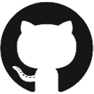
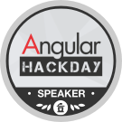

[[imgBadge]]
| 

[[imgBadge]]
| 

[[imgBadge]]
| 

[[imgBadge]]
| 

[[imgBadge]]
| 

[[imgBadge]]
| 

[[imgBadge]]
| 

[[imgBadge]]
| 

[[imgBadge]]
| 

Matt is an SSW Solution Architect, Certified Scrum Master and one of four Microsoft certified DevOps fast track partner consultants in Australia.  
He has been developing solutions using the full Microsoft stack since .NET 2 was in beta.

Matt has had experience with companies ranging from small businesses to large ASX listed companies in the finance, engineering and HR sectors, helping them with:

- Build and Release Pipelines (upgrading from XCopy deploy processes to full CI/CD automation on GitHub or Azure DevOps)

- Document automation

- Process automation

- Dynamics 365 CRM

- B2B integrations (integrating with Banks and Multinational Petrol companies)

- ALM setup and management (using Microsoft and Atlassian stacks)

- PABX systems

Matt loves DevOps, DevOps, and DevOps. These days he prefers GitHub Actions and Azure DevOps Build Pipelines over Octopus and Bamboo. Matt likes clean architecture, using the right tool for the job, seeing developers push changes to production with confidence, automated tests, building solutions on Azure, and now he never has to reminisce about Web Forms.

