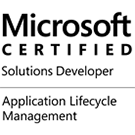

[[imgBadge]]
|  

Mehmet is a Solution Architect at SSW, a Microsoft Certified Solutions Developer specialising in Power BI, SSRS, Dynamics 365, and SharePoint solutions. Mehmet has extensive experience in Microsoft products both pre and post .NET and loves working with C#, Power Query, DAX, and SQL. In previous roles before SSW, Mehmet has worked with BI tools such as Teradata Data Warehouse, Oracle DRM (Master Data Management), Essbase and Cognos ReportNet.

Mehmet also helps many clients and SSW with infrastructure-related tasks.

#### Some recent clients

* **[Screen Producers](https://www.screenproducers.org.au/)**  
Mehmet worked with fellow SSW develop Greg to implement Dynamics 365 as the membership and event management system for Screen Producers Australia. Dynamics 365 was customised with additional entities to support SPA's membership levels and event management. Kentico cloud was used as the public front end to display Event data to the public, with SPA's members receiving discounted pricing.  
    *Related Technologies: Dynamics 365, Kentico Cloud*

* **[Multigate Medical](https://multigate.com.au/)**  
Multigate approached SSW to implement a Dynamics 365  rollout. On this project, Mehmet worked with Multigate to develop all the CRM customizations. Custom entities and processes were created to fit Multigate's sales process.  
    *Related Technology: Dynamics 365*

* **[SDN Childcare](https://sdn.org.au/)**  
Mehmet upgraded SDN to Dynamics 365 from CRM 2013 with an Internet-facing deployment and previously from CRM 2011 to CRM 2013. This new platform will be used as a foundation of ongoing CRM development at SDN.  
    *Related Technologies: Dynamics 365, ADFS 3.0, Windows Web Application Proxy*

* **[Productivity Development Solutions](https://pdsglobal.com)**  
Mehmet converted slow running SQL Server Stored procedures that were running in overnight batch jobs, to near real-time SQL. Optimizing slow running cursor-based code to more efficient SQL. SQL Server Reporting Services improvements to better use optimized SQL stored procedures.  
    *Related Technologies: SQL Server, Reporting Services*

* **[Carnival](https://www.carnival.com.au/)**  
Mehmet worked with the carnival team to implement new data warehouse loads. This on-going work also includes the maintenance and design of SQL Server Analysis Services cubes. The cubes are used by in the business to analyze occupancy rates and verifying the effectiveness of marketing campaigns.  
    *Related Technologies: SQL Server, Reporting Services, Analysis Services, SQL Server Integration Services*

* **[Agrifoods Global](https://www.agrifoodsglobal.com/)**  
Feature enhancements and maintenance on internal logistics database. Syncing SQL database from remote systems, adding new database feeds. Recently Mehmet has migrated Mac from SQL Server 2005 to current version of SQL Server. The upgrade also includes upgrading connections to all remote systems.  
    *Related Technologies: SQL Server, Great Plains, SQL Server Integration Services*

* **[Hong Kong Aviation](http://www.hongkongaviation.com/)**  
 Migration of MS Access based asset tracking system to SQL Server 2008 R2  
    *Related Technologies: SQL Server 2008 R2, SQL Server Integration Services 2014, Web Services*

* **[Turbomeca](https://www.safran-helicopter-engines.com/)**  
Migration of SharePoint 2007 intranet and Document workflow system to SharePoint 2010. Migrate from single server to full farm deployment; with separate development, testing and production servers, all virtualised using HyperV R2.  
    *Related Technologies: Windows 2008 R2, HyperV, SharePoint 2010, SQL Server 2008*
