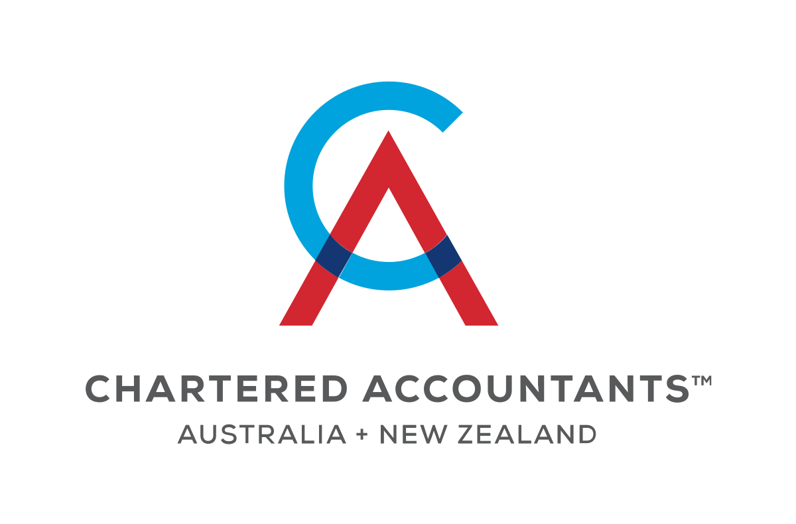
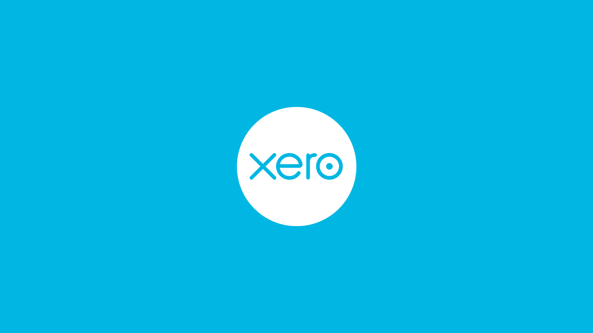
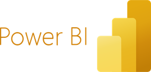

[Editing your profile]: https://github.com/SSWConsulting/People/wiki/3.-Editing-your-profile

[[imgBadge]]
| 

[[imgBadge]]
| 

[[imgBadge]]
| 

[[imgBadge]]
| 

Nick is a fully qualified Chartered Accountant at SSW Australia with 7+ years of accounting experience. He is an advocate for forward thinking and sustainable accounting practices. 

With varying experience between accounting firms and private businesses, Nick aims to continue to provide his innovative expertise across all accounting areas, especially with small businesses and Xero. Nick's experiences go into far reaching sectors, including those of established businesses and that of start-ups, especially research and development projects.

Nick aims to align the goals of SSW with the technological and software changes affecting the accounting industry and that of all businesses and their accountancy.

Nick is an open minded quiet achiever, but also displays an exuberant and fiercly competitive attitude. Nick is proud to have represented Australia in a range of sports including Powerlifting and Dragonboating. His greatest achievemens in these sports include multiple podiums at the World Championships. 

Outside of sports, Nick is an avid volunteer. Some of the initiatives he has contributed to include:
- Acting as a Chairperson in the organising committee of a Nation-wide charity run for Breast Cancer Research
- Various beach and lake clean ups
- Participating in bushfire clothing run initiatives
- Guiding attendees at tennis tournaments as a Tennis Australia volunteer
