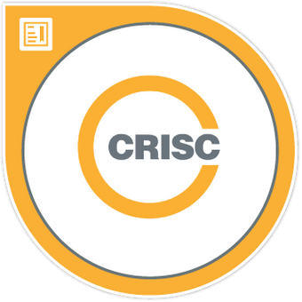

<table cellspacing="0" width="100%" class="ms-rteTable-0"><tbody><tr><td class="ms-rteTableEvenRow-0" style="width:50%;"> 
  

 </td><td class="ms-rteTableEvenRow-0" style="width:50%;text-align:center;"> 
  
</td></tr></tbody></table>

Prem is a Solution Architect at SSW and brings over 12 years of enterprise software development and management experience to the SSW Team. Having worked with clients across various domains including telecom, automotive, retail and pharma, Prem specialises in building performance incentive platforms for his clients. His claim to fame is building a rostering and sales commission payment system for one of Australia's telecom giants and a custom ETL solution that is still being widely used in the company after 10 years. As a certified CRISC and CISM professional, Prem also has a wider interest in IT risk and security. 

If time and money were not a factor, he would try his hand at opening a cafe serving stupendous sandwiches and spectacular coffee.  
