# People

Welcome to People.SSW !
All SSW Profiles have been automatically migrated from our previous iteration (hosted on SharePoint) and therefore might not be optimized. Please, feel free to fix typos and styling mistakes.

These markdown files are used by our Gatsby static site generator to generate https://people.ssw.com.au/

Gatsby generator project: https://github.com/SSWConsulting/people.ssw.com.au/

Sample Profile: https://www.ssw.com.au/people/bob-northwind

# Instructions

## How to create a new profile

1. In CRM, ensure that you have an user profile or create user profile in CRM  - https://live.crm.ssw.com.au/main.aspx#

  
**Figure: Find your user profile in CRM**

If your name is not in the list click in **+ New**

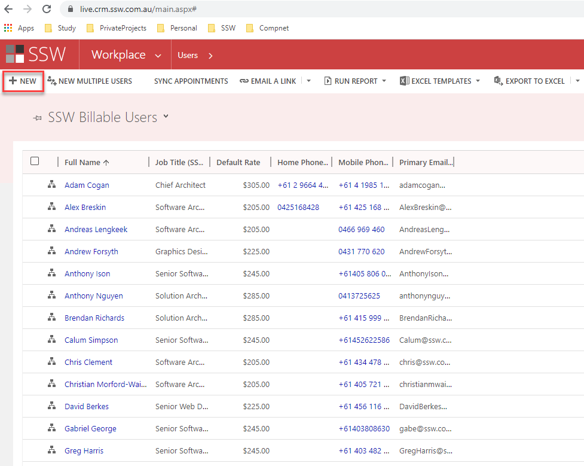  
**Figure: Add New**

2. Fork the repository SSWConsulting/People - Branch: **master**

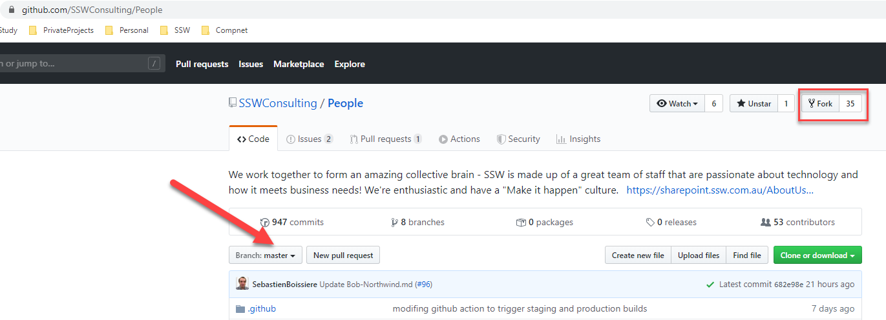  
**Figure: Fork the Repository to be able to create a new profile**

3. Clone your forked repository

> Hint: You can use [GitHub Desktop](https://desktop.github.com/)

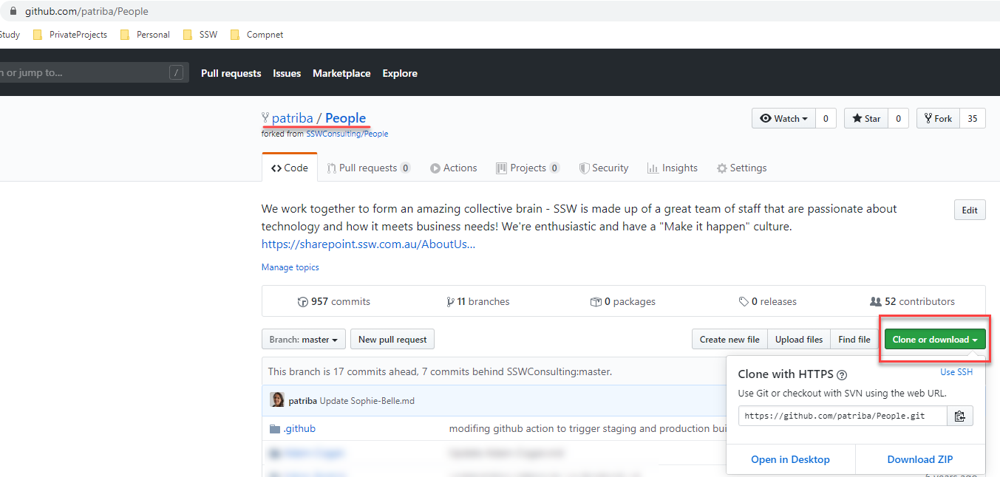  
**Figure: Clone the forked repository to start to create a new profile**

4. In Windows Explorer, Copy & Paste **"Bob Northwind"** Profile folder

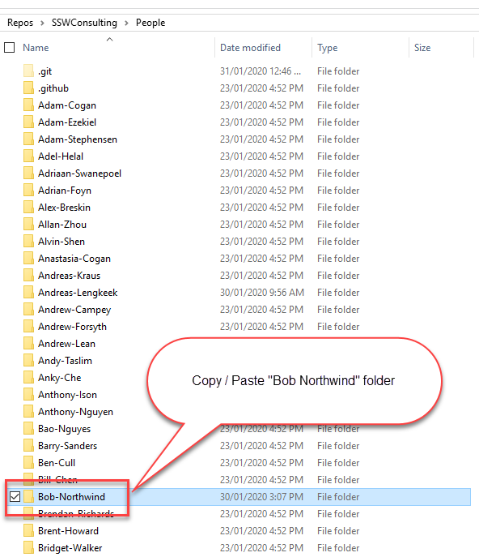  
**Figure: Copy & Paste "Bob Northwind" folder**

5. Change folder and file names to match user’s **Firstname-Lastname** identifier
   - **Firstname-Lastname** must be identical to CRM data

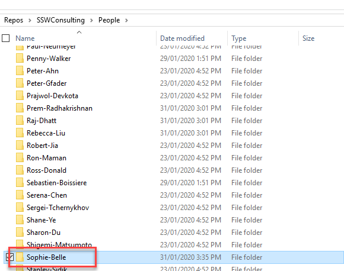  
**Figure: Change folder's name from "Bob-Northwind" to "Firstname-Lastname"**

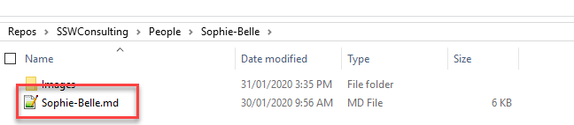  
**Figure: Change profile file's name from "Bob-Northwind" to "Firstname-Lastname"**

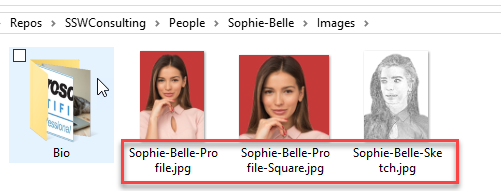  
**Figure: Replace the profile images from "Bob-Northwind" to "Firstname-Lastname"**

6. Open Firstname-Lastname.md file and update profile information

  
**Figure: Open & Update profile file**
> If you want to include badges to your profile, first look for the image in the **/badges** folder

> If you want to add images or your badge is not in the **/badges** folder, follow the instruction in **[How to add images on GitHub](#how-to-add-images-on-github)** section

7. Commit your changes

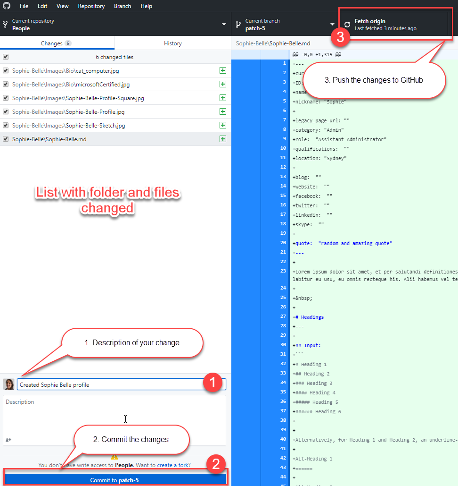  
**Figure: Commit your changes**

8. Create Pull Request and you are done
    - Follow instructions in the **step 5** in **[How to publish your changes](#how-to-publish-your-changes)** section

> TODO: Improve user experience (automation)

## How to edit your profile on GitHub

1. Find your folder from the root
2. Navigate to [Firstname]-[Lastname].md
3. Make your changes

> Hint: you can use https://github.com/adam-p/markdown-here/wiki/Markdown-Cheatsheet if you are not familiar with Markdown

> Important: Do not modify your name, it needs to match your name in CRM

## How to add images on GitHub

If the image you want to use exist in the '/badges' folder:

1. Reference the images in your Bio using ``

If the image you want to use doesn't exist in the '/badges' folder:

1. Navigate to your profile folder
2. Navigate to /People/[Firstname]-[Lastname]/Images/Bio

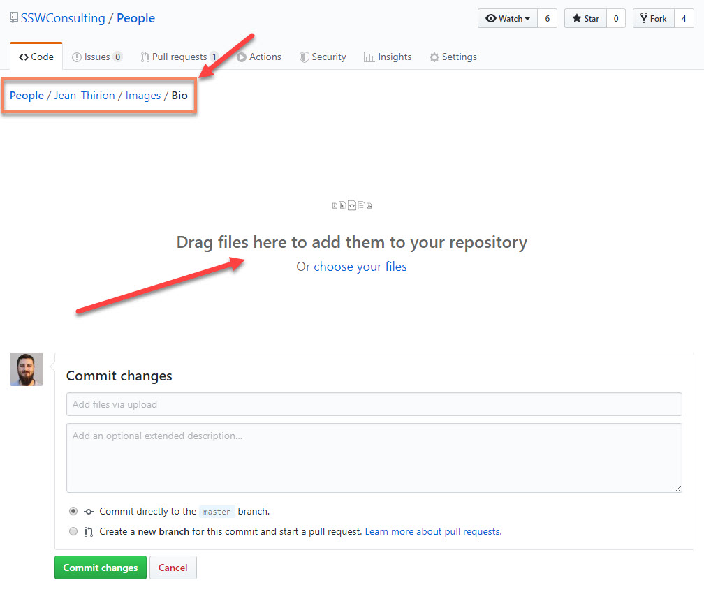
**Figure: Uploading new files**

3. Reference the images in your Bio using ``

> Important:
>
> - Avoid spaces in filenames, use hyphens instead
> - Upload images with a width of at least 135px

## Set images sizes

Our Markdown processor uses custom Markups to extend markdown capabilities on image styling. Images added to your profile can be defined as :

- "Badge" - inline fixed 135px maximum width
- "Small" - fixed 200px maximum width
- "Medium" - fixed 400px maximum width
- "Large" - no maximum width

To assign one those predefined styles to an image, use the following syntax:

```
[[Custom_Style_Code]]
| 
```

Example:

```
[[imgBadge]]
| 
```

Available styles :

| Style name | Code     | Inline | Image max-width | Caption |
| ---------- | -------- | ------ | --------------- | ------- |
| Badge      | imgBadge | true   | 135px           | false   |
| Small      | imgSm    | false  | 200px           | true    |
| Medium     | imgMd    | false  | 400px           | true    |
| Large      | imgLg    | false  | none            | true    |

## How to publish your changes

1. Navigate to your markdown profile
2. Click "Edit"

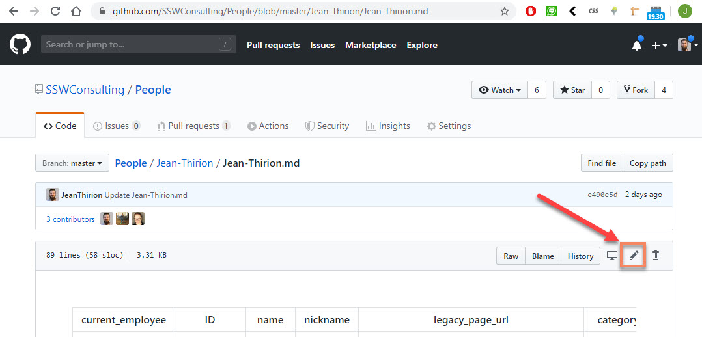
**Figure: Enabling edit mode in GitHub**

3. Make your changes
4. Click "Propose File Change"

> Important: Please add a description for your changes so reviewers have context when approving your changes

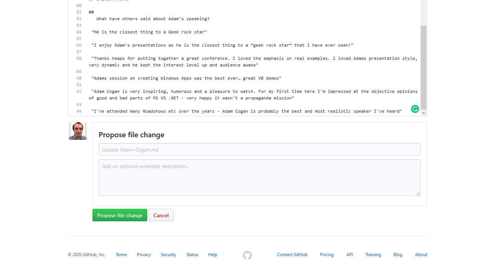
**Figure: Saving changes**

5. Click "Create Pull Request"

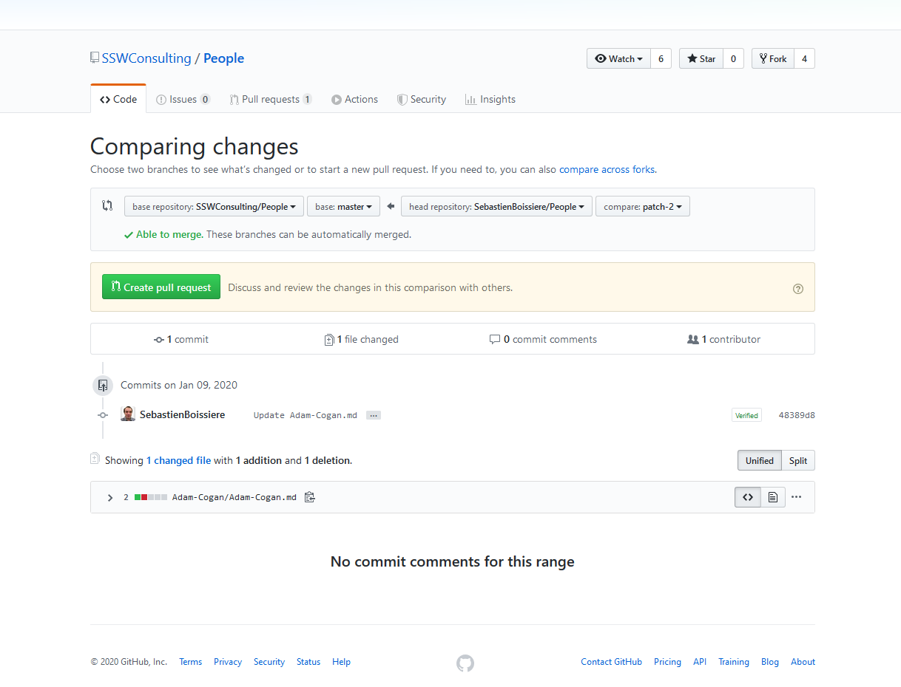
**Figure: Creating pull request (PR)**
