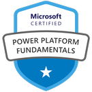

[[imgBadge]]
| 

[[imgBadge]]
| 

[[imgBadge]]
| 

[[imgBadge]]
| 

[[imgBadge]]
| 

[[imgBadge]]
| 

[[imgBadge]]
| 

[[imgBadge]]
| 

[[imgBadge]]
| 

[[imgBadge]]
| 

---

Ravi is a Software Developer based in SSW Sydney office. He is passionate to learn and master new technologies. He has worked with a wide range of technologies, including .NET, React, Android, Xamarin, SQL, and Azure. In addition to that, he has more than 2 years of frontend development experience. He is also passionate about digging into systems to understanding how things work.
