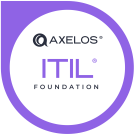

[[imgBadge]]
| 
[[imgBadge]]
| 
[[imgBadge]]
| 
[[imgBadge]]
| 
[[imgBadge]]
| 

---

Rob is a skilled Systems Administrator with over five years experience working for Managed Service Providers (MSPs). He specializes in managing complex IT infrastructures, including VM/Hypervisors, Remote monitoring and management tools, VoIP, endpoints, firewalls, database and network administration. Rob holds several certifications complementing his expertise.

Rob's past experiences working for MSPs has given him a broad understanding to a wide variety of industries and the unique IT challenges they face. These roles have allowed him to develop his versatile skill set with a wide range of technologies and best practices he is able to provide the highest standard of service to SSW Clients. 

Rob excels in supporting small businesses or large enterprises. Known for his problem-solving abilities and commitment to continuous improvement, Rob is dedicated to delivering reliable and scalable IT solutions that drive business success.

**Industries**: Automotive, Mining, Agriculture, Retail, Manufacturing, Education, Healthcare, Finance, Legal

**Technologies**:
- Intune
- Vmware
- V-Sphere
- CW Automate
- Ansible
- Packer
- Terraform

**Key Skills and Achievements**:
- Device Managment: Experienced in workplace automation and modernization, leveraging Intune, Windows Autopilot, and RMM tools to automate common issues and achieving zero touch deployments, significantly reducing time and effort for businesses to manage.
- Cloud Virtualisation: Experienced in workplace automation and modernization for clients, leveraging Intune, Windows Autopilot, and RMM tools to streamline laptop and computer deployments, significantly reducing time and effort for businesses.

**Professional Development**:
- CW Automate Profesional & Expert Certifications
- ITIL 4 Foundations Certificate

Rob is regularly updating his skills in cloud infrastructure, cybersecurity, IT operations and DevOps through certifications and hands-on experience testing the lastest tools.
