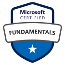

[[imgBadge]]
| 
[[imgBadge]]
| 
[[imgBadge]]
| 
[[imgBadge]]
| 
[[imgBadge]]
| 

---

Robert is a skilled Systems Administrator with over five years experience working for Managed Service Providers (MSPs). He specializes in managing complex IT infrastructures, including VM/Hypervisors, Remote monitoring and management tools, VoIP, endpoints, firewalls, database and network administration. Robert holds several certifications complementing his expertise.

Robert's past experiences working for MSPs has given him a broad understanding to a wide variety of industries and the unique IT challenges they face. These roles have allowed him to develop his versatile skill set with a wide range of technologies and best practices he is able to provide the highest standard of service to SSW Clients. 

Robert excels in supporting small businesses or large enterprises. Known for his problem-solving abilities and commitment to continuous improvement, Robert is dedicated to delivering reliable and scalable IT solutions that drive business success.
