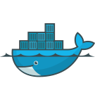
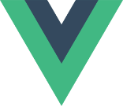
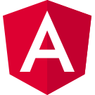

---

id: "38cf8d10-8b69-ef11-a670-00224896c3f4"
qualifications: "Master of Information Technology"
quote: "It's not just beauty at this dimension, at one centimeter; there's also beauty at smaller dimensions, the inner structure, also the processes."
quoteAuthor: "Richard P. Feynman"

---

[[imgBadge]]
| 

[[imgBadge]]
| 

[[imgBadge]]
| 

[[imgBadge]]
| 

[[imgBadge]]
| 

[[imgBadge]]
| 

[[imgBadge]]
| 

[[imgBadge]]
| 

[[imgBadge]]
| 

[[imgBadge]]
| 

[[imgBadge]]
| 

---

✨ A full-stack developer with experience spanning modern web applications, cloud platforms, data engineering, and DevOps. Sam works across the complete software lifecycle — from building user-focused applications with Angular, React, Vue, and .NET, through to designing cloud infrastructure with Terraform, deploying containerised workloads, and building modern data platforms with Microsoft Fabric.

♟️ A highly collaborative developer and enthusiastic problem solver, Sam enjoys working closely with clients and teams to understand complex problems and deliver practical solutions. Comfortable owning projects end-to-end, he combines hands-on development with architectural thinking to help teams design maintainable, scalable, and practical solutions.

🥁 Outside of work, Sam enjoys exploring new hobbies and building community, whether that be playing footy, organising board game nights, climbing, or performing with one of his bands.

---

**Client Delivery & Technical Leadership:** Experienced working directly with clients to understand requirements, evaluate technical trade-offs, and deliver solutions that balance engineering quality with business outcomes.

**Software Architecture & Engineering Practices:** Experienced applying modern software engineering principles including clean architecture, vertical slice architecture, automated testing, code quality practices, and maintainable solution design.

**Full-Stack Development:** Extensive experience delivering scalable web applications using .NET, Angular, React, and Vue. Strong focus on clean architecture, maintainability, performance, and creating intuitive user experiences. Experienced working across frontend, backend, APIs, and application architecture.

**Cloud Architecture & DevOps:** Experienced with Azure, AWS, Terraform, Docker, Kubernetes, and CI/CD automation, building automated deployment pipelines and infrastructure solutions that improve reliability, scalability, and developer productivity.

**Data Engineering & Analytics:** Experience designing modern data platforms using Microsoft Fabric, including metadata-driven ingestion frameworks, Bronze/Silver/Gold data architectures, semantic models, and enterprise reporting solutions.

**Embedded Systems & IoT:** Experience deploying and managing applications on embedded devices using Raspberry Pi and Docker, bridging software solutions with physical devices and real-world environments.
